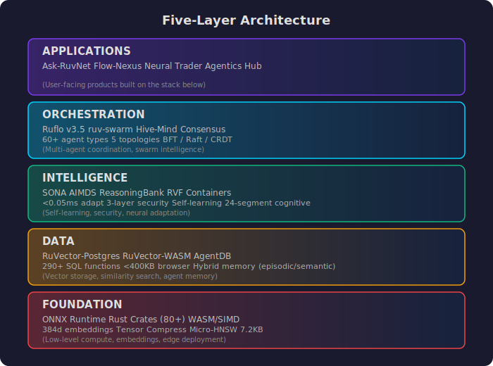
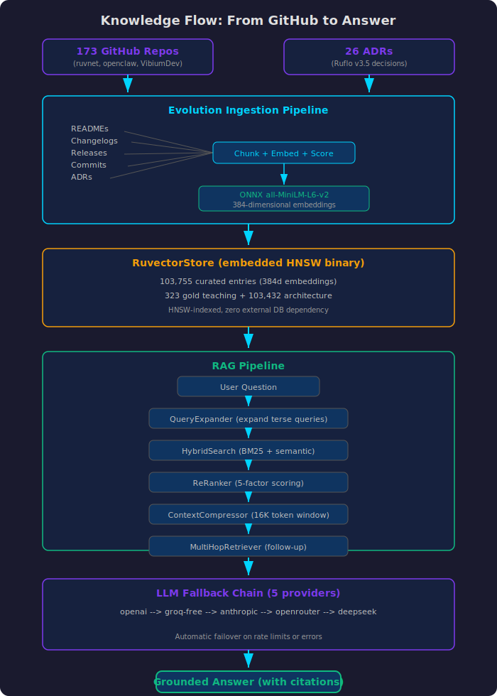
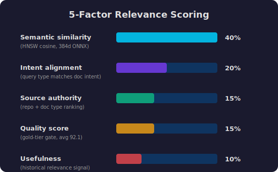
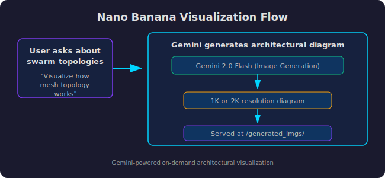
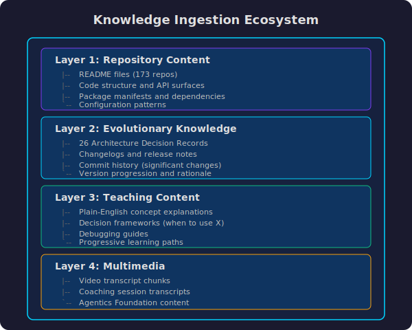
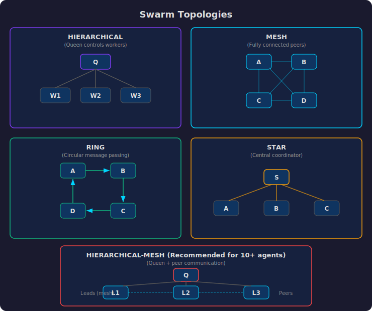
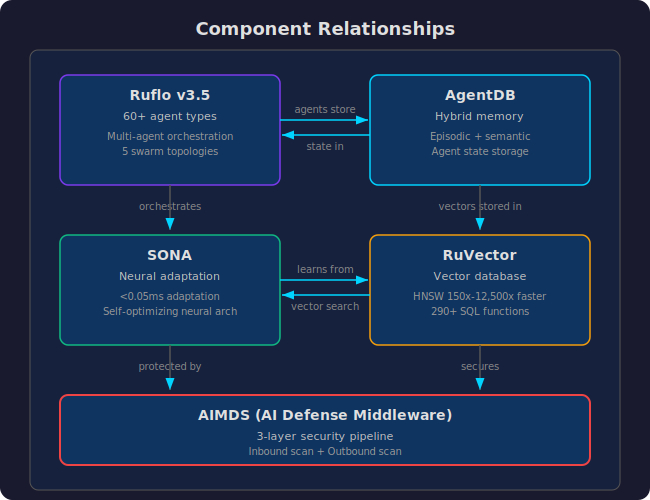
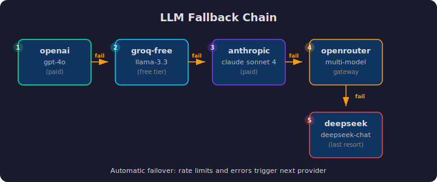
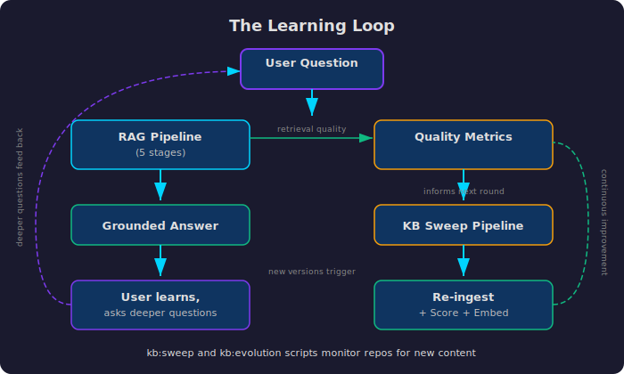

# Ask-RuvNet

> Updated: 2026-03-12 | Version 3.6.4

**The front door to one of the most ambitious open-source AI architecture projects ever built.**

Ask-RuvNet is a RAG-powered knowledge assistant that makes 155+ interconnected repositories, 26 architecture decision records, and years of engineering decisions searchable, explainable, and visual. It exists because understanding an ecosystem this large should not require reading 102,857 curated documents.

**Production:** https://ask-ruvnet-production.up.railway.app

---

## Knowledge Base Architecture (RVF-First)

> **This is the definitive architecture. There is ONE source of truth. No external databases at runtime. No Neon. No Railway PostgreSQL. Just RVF.**

### The Single Source of Truth

The entire Ask-RuvNet knowledge base is distributed as a single file: **`knowledge.rvf`** (151 MB). This is an [RVF (RuVector Format)](https://github.com/ruvnet/ruvector) cognitive container — a segmented binary file that holds vectors, an HNSW search index, and metadata all in one place. No database server is needed at runtime. The `.rvf` file IS the database.

**Current stats:**
- 102,857 vectors (323 expert-curated + 102,534 architecture reference docs)
- 384 dimensions (all-MiniLM-L6-v2 ONNX embeddings)
- HNSW index: M=16, efConstruction=200, cosine metric
- Shipped via Git LFS, extracted at Docker build time
- @ruvector/rvf v0.2.0 (Rust N-API bindings for Node.js)

### Three Consumers, One Source

```
PostgreSQL (local authoring workbench, never deployed)
       |
       | Nightly 5AM pipeline (LaunchAgent: ai.openclaw.kb-export)
       v
  .ruvector/knowledge-base/ (intermediate binary format)
       |
       +---> knowledge.rvf (151 MB)  ---> Railway server (read-only, /api/search)
       |
       +---> SQ8 browser assets      ---> Browser client (WASM HNSW, ~5ms search)
       |     (9.9 MB gzipped)              Web Worker in rvf-search-worker.js
       |
       +---> MCP embedded KB         ---> Claude Code MCP tools (kb_search, etc.)
             (kb-entries.json +              Zero dependencies, 15-30ms search
              kb-embeddings.bin)
```

Every consumer reads the same data compiled from the same source. Counts are verified to match after every pipeline run.

### Why RVF (and Why Nothing Else)

| Alternative | Why It Was Rejected |
|-------------|-------------------|
| Neon PostgreSQL | Deleted. External dependency, connection timeouts, SSL config, hosting costs. |
| Railway PostgreSQL | Unnecessary. Adds $7-20/month, creates another sync point, RVF already works. |
| Raw flat files | No search index. Brute-force cosine on 102K vectors takes ~100ms vs 5ms with HNSW. |
| Embedded SQLite | No native vector search. Would need custom HNSW implementation. |

RVF was designed for exactly this use case: a static knowledge base that gets compiled nightly and served to multiple consumers as a self-contained artifact. Like compiling source code into a binary — you edit the source (PostgreSQL), you ship the binary (RVF).

### RVF File Format

A `.rvf` file contains multiple segments, each carrying a different payload:

| Segment | ID | What It Stores | Used Here |
|---------|-----|---------------|-----------|
| MANIFEST_SEG | 0x00 | File metadata (dimensions, metric, epoch) | Yes |
| VEC_SEG | 0x01 | Raw float32 vectors | Yes |
| INDEX_SEG | 0x02 | HNSW graph structure | Yes |
| META_SEG | 0x03 | Per-vector metadata (title, category, quality) | Yes |
| QUANT_SEG | 0x04 | Quantization codebooks | Yes |
| OVERLAY_SEG | 0x05 | LoRA adapter weights | No |
| GRAPH_SEG | 0x06 | Property graph adjacency | No |
| WASM_SEG | 0x08 | Embedded WASM modules | No |
| KERNEL_SEG | 0x0E | Linux microkernel (self-booting) | No |
| COW_MAP_SEG | 0x20 | Copy-on-write branching | No |

Unknown segments are preserved by all tools — the format is forward-compatible.

### Nightly Pipeline

The pipeline is orchestrated by `scripts/kb-export-pipeline.mjs` and runs at 5:00 AM daily via LaunchAgent `ai.openclaw.kb-export`.

```
Stage 1: PostgreSQL --> .ruvector/knowledge-base/
         export-to-ruvectorstore.mjs
         Reads ask_ruvnet.kb_complete + architecture_docs
         Outputs: vectors.bin (157 MB) + metadata.json (186 MB) + manifest.json

Stage 2: .ruvector/ --> Browser SQ8 assets
         build-quantized-rvf.mjs
         Float32 --> Uint8 scalar quantization (0.9999 cosine quality)
         Outputs: knowledge-sq8.bin.gz (8.8 MB) + knowledge-sq8-params.bin.gz (2.6 KB)
                  + knowledge-meta.json.gz (1.1 MB)

Stage 3: .ruvector/ --> knowledge.rvf
         convert-to-rvf.mjs
         Creates RVF with HNSW index (M=16, efConstruction=200)
         Output: knowledge.rvf (151 MB)

Stage 4: .ruvector/ --> MCP embedded KB
         export-mcp-kb.mjs
         Generates full dataset in MCP-compatible format
         Outputs: kb-entries.json + kb-embeddings.bin

Verify:  kb-sync-verify.mjs
         Confirms PG count == manifest count == RVF count == browser asset count
```

### Compression Ratios

| Format | Size | % of Source | Used By |
|--------|------|------------|---------|
| PostgreSQL source | 343 MB | 100% | Local authoring |
| knowledge.rvf | 151 MB | 44% | Railway server |
| Browser SQ8 (gzipped) | 9.9 MB | 2.9% | Web client |
| MCP embedded KB | ~55 MB | 16% | Claude Code |

### File Inventory

```
knowledge.rvf                        151 MB   Production store (Git LFS)
knowledge.rvf.idmap.json             4.1 MB   String ID -> numeric mapping

.ruvector/knowledge-base/
  manifest.json                      251 B    Source metadata
  vectors.bin                        157 MB   Float32 vectors (102,857 x 384 x 4)
  metadata.json                      186 MB   Per-vector metadata sidecar

src/ui/public/assets/
  knowledge-sq8.bin.gz               8.8 MB   Quantized vectors for browser
  knowledge-sq8-params.bin.gz        2.6 KB   SQ8 parameters (min/max per dim)
  knowledge-meta.json.gz             1.1 MB   Compact metadata for browser
  rvf-search-worker.js               ~8 KB    Web Worker (WASM HNSW search)
  wasm/rvf_wasm_bg.wasm              46 KB    WASM control plane

scripts/
  kb-export-pipeline.mjs                      Pipeline orchestrator
  export-to-ruvectorstore.mjs                 Stage 1: PG -> binary
  build-quantized-rvf.mjs                     Stage 2: binary -> browser
  convert-to-rvf.mjs                          Stage 3: binary -> RVF
  export-mcp-kb.mjs                           Stage 4: binary -> MCP
  kb-sync-verify.mjs                          Post-export verification
```

### Manual Pipeline Commands

```bash
# Full pipeline (all stages + verify)
node scripts/kb-export-pipeline.mjs --force --verbose

# Individual stages
node scripts/export-to-ruvectorstore.mjs           # Stage 1: PG -> binary
node scripts/export-to-ruvectorstore.mjs --fresh    # Stage 1: clean rebuild
node scripts/build-quantized-rvf.mjs                # Stage 2: binary -> browser
node scripts/convert-to-rvf.mjs                     # Stage 3: binary -> RVF
node scripts/export-mcp-kb.mjs                      # Stage 4: binary -> MCP

# Verification
node scripts/kb-sync-verify.mjs                     # Check sync (exit 0=OK, 1=stale)
node scripts/kb-sync-verify.mjs --fix               # Auto-fix if stale
```

### PostgreSQL: Local Authoring Only

Docker PostgreSQL (port 5435) is the **workbench** where knowledge entries are created, edited, deduplicated, and curated. Think of it like Word — you edit in Word, you ship the PDF. PostgreSQL is Word. RVF is the PDF.

PostgreSQL is needed because:
- RVF is append-only (no in-place updates to individual entries)
- SQL enables complex queries for curation (`WHERE quality_score < 50 AND is_duplicate = true`)
- Deduplication logic runs in PG before export
- 51 other schemas with personal/client data live in PG (these NEVER leave the machine)

PostgreSQL is **never deployed**, **never exposed**, and **not needed at runtime**. If the KB stabilizes and edits become rare, PG could eventually be dropped entirely.

### MCP Context Efficiency

The MCP server operates in two modes:
- **PostgreSQL mode** (when Docker is running): Full SQL search, returns complete content fields. ~7,500 chars per query.
- **Embedded WASM mode** (no Docker needed): Uses kb-entries.json for metadata-only results, content loaded on-demand. ~1,000 chars per query. **~7x fewer context tokens.**

---

## What's New in v3.1.0

### Resource Drawer

v3.1 adds a **Resource Drawer** — a collapsible panel accessible via a folder icon in the chat input area. The drawer contains all four capability tiles (Videos, Decks, Knowledge Universe, KB) and all five resource documents (four PDFs + one video), available at any point during a conversation.

### Light Mode Contrast Fixes

Targeted CSS overrides for `.light-mode` elements with proper border colors, subtle shadows, and improved text contrast.

### Mobile Polish

Resource drawer adapts to mobile viewports (375px–768px). Canvas views on mobile use a fullscreen overlay instead of the desktop split-panel layout.

---

## What's New in v3.0.0

### Complete Visual Overhaul

v3.0 is a ground-up redesign of the Ask-RuvNet frontend. The interface moves from a conventional chat layout to an immersive, modern experience built around glassmorphism, animated gradients, and color-coded visual hierarchy.

### v3.0 Visual Design

**Capability Tiles** -- The landing screen presents four capability tiles (Videos, CEO/CTO Decks, Knowledge Universe, KB) as glassmorphism cards with frosted-glass backgrounds, layered shadows, and color-coded accents. Each tile uses a distinct accent color (red, blue, purple, amber) to establish visual identity at a glance.

**Aurora Background** -- The entire interface sits on an animated aurora background with layered radial gradients that shift continuously. This replaces the static dark background from v2.x and gives the application a sense of depth and motion.

**Stats Bar** -- A persistent stats bar displays live ecosystem data (repository count, KB entries, architecture decisions, quality score) directly on the landing screen. Users see the scale of the knowledge base before asking their first question.

**Prompt Starters** -- Six prompt starters (up from four in v2.x) are displayed as pill-shaped buttons below the input field. Each starter is written to demonstrate a different query style: architecture, practical usage, decision-making, evolution, deep technical, and ecosystem overview.

**Resource Documents Grid** -- A grid of resource cards (four PDFs and one video) appears below the capability tiles. Each card links to a specific document or media asset with a descriptive label and file-type indicator.

**Follow-Up Suggestion Pills** -- After the assistant responds, a row of contextual follow-up suggestions appears as clickable pills beneath the answer. These are generated based on the response content and guide the user toward deeper exploration.

**Gradient Text and Layered Shadows** -- Section headers and key labels use CSS gradient text (linear gradients across the text fill). Cards and interactive elements use multi-layer box shadows for a lifted, dimensional appearance.

**Staggered Entrance Animations** -- Capability tiles, prompt starters, and resource cards animate in with staggered delays on page load. Each element fades up and slides into position sequentially, creating a polished reveal sequence.

**Color-Coded Accent System** -- A four-color accent system (red, blue, purple, amber) is applied consistently across capability tiles, source badges, and interactive elements. Each color maps to a content category, making the interface scannable without reading labels.

### Retained from v2.x

The following features from v2.x remain fully intact in v3.0:

- **Rich responses with source citations** -- inline GitHub links, doc-type awareness, Related Resources and Explore Further sections
- **Source cards** -- clickable cards with doc-type badges, relevance scores, and direct GitHub links
- **Evolutionary knowledge ingestion** -- 13,192 chunks across 155+ repositories and 3 GitHub organizations
- **Full pipeline command** -- `npm run kb:full` runs the complete ingestion pipeline
- **Gemini visual integration** -- Visualize button generates architectural diagrams via Gemini 2.0 Flash
- **Markdown link styling** -- properly styled, clickable hyperlinks in chat responses

---

## What's New in v3.5.0

### NotebookLM Studio Pipeline

v3.5 adds a fully automated NotebookLM content pipeline. Nine studios — deep-dive audio, architecture explainers, whiteboard videos, a business case slide deck, and an ecosystem infographic — are generated from 115 curated notebook sources and auto-synced to the app. A nightly LaunchAgent handles source refresh, studio regeneration, asset download, and App.jsx resource sync. Auto-authentication via agent-browser CDP eliminates manual auth renewal.

### Ruflo Rebrand

All references to Claude Flow have been updated to Ruflo across ~324 files and ~2,900 replacements. The CLI is now `npx ruflo@latest`. NPM scope `@claude-flow/*` is preserved for backward compatibility.

---

## Strategic Goals

Ask-RuvNet is evolving from a knowledge assistant into **the definitive on-ramp** to the RuvNet ecosystem. These goals drive the next phase of development. Full tracking: [`docs/TODO.md`](docs/TODO.md).

### 1. Smarter AI Output

Responses should be intelligent artifacts — not text walls. Auto-generated comparison tables for architecture questions. Inline Mermaid diagrams. Contextual resource cards that surface relevant videos, decks, and audio when the topic matches. Quick actions (Visualize, Code Example, Deep Dive) after every response.

### 2. NotebookLM Integration

A dynamic NotebookLM notebook with 115 sources and 9 generated studios exists alongside Ask-RuvNet. Users should discover it — via a capability tile on the hero, a link in the resource drawer, and contextual mentions in chat responses when a deep-dive audio or explainer video covers the topic being discussed.

### 3. World-Class Executive Content

The CEO deck explains why this technology tears down departmental walls and enables cross-functional AI that no other platform offers. The CTO deck explains why this is the ultimate toolkit — generations beyond Gen 1 tools (Cursor, Copilot, LangChain) that are 9+ months behind. Both are built via PPTX with custom layouts, data visualizations, competitive positioning, and concrete ROI. Target quality: 9.5/10.

### 4. MCP Package

The NotebookLM source refresh and studio pipeline is being packaged as a publishable MCP server (`@ruvnet/nlm-pipeline-mcp`) so others can install and run it with `claude mcp add`.

### 5. On-Ramp Experience

Based on patterns from Vercel, Supabase, Stripe, and LangChain: dual-audience hero (business leaders vs developers), progressive disclosure, live product demos, time-to-value metrics, social proof, and content-led growth where each NLM studio becomes a shareable entry point.

---

## The Big Picture

Ruben Cohen (rUv) has spent years building something unusual: not a single AI product, but an entire *ecosystem* of interlocking systems that span agent orchestration, self-learning vector databases, graph neural networks, cognitive containers, distributed swarm intelligence, and neuromorphic computing.

Across **155+ repositories** in three GitHub organizations (ruvnet, openclaw, VibiumDev), the RuVNet ecosystem covers:

- **Agent orchestration** -- [Ruflo v3.5](https://github.com/ruvnet/ruflo), ruv-swarm, agentic-flow
- **Vector databases** -- RuVector (PostgreSQL-native, WASM, neuromorphic)
- **Self-learning AI** -- SONA, AIMDS, ReasoningBank, LoRA adapters
- **Cognitive containers** -- RVF format (24-segment, self-booting, 5.5KB WASM)
- **Graph intelligence** -- GNN, min-cut analysis, Louvain community detection
- **Synthetic data** -- Agentic Synth, procedural generation
- **Distributed consensus** -- Byzantine, Raft, CRDT, Gossip protocols
- **Robotics** -- ROS3 (Rust-native robot operating system)

The problem is obvious: no human can hold all of this in their head. Ask-RuvNet is the solution. It ingests everything -- READMEs, changelogs, ADRs, commit messages, release notes, code structure -- and makes it conversational.

Ask a question. Get an answer grounded in the actual codebase, not in an LLM's stale training data.

---

## The Five-Layer Architecture

The RuVNet ecosystem is organized into five layers. Each layer builds on the one below it.



<details>
<summary>ASCII Version (for AI/accessibility)</summary>

```
┌─────────────────────────────────────────────────────────┐
│                    APPLICATIONS                          │
│  Ask-RuvNet  Flow-Nexus  Neural Trader  Agentics Hub    │
│  (User-facing products built on the stack below)        │
├─────────────────────────────────────────────────────────┤
│                   ORCHESTRATION                          │
│  Ruflo v3.5        ruv-swarm    Hive-Mind Consensus     │
│  60+ agent types   5 topologies   BFT / Raft / CRDT    │
│  (Multi-agent coordination, swarm intelligence)         │
├─────────────────────────────────────────────────────────┤
│                   INTELLIGENCE                           │
│  SONA     AIMDS      ReasoningBank     RVF Containers   │
│  <0.05ms  3-layer    Self-learning     24-segment       │
│  adapt    security   with LoRA/EWC++   cognitive fmt    │
│  (Self-learning, security, neural adaptation)           │
├─────────────────────────────────────────────────────────┤
│                      DATA                                │
│  RuVector-Postgres   RuVector-WASM    AgentDB           │
│  290+ SQL functions  <400KB browser   Hybrid memory     │
│  HNSW 150x-12500x   Zero backend     Episodic/semantic │
│  (Vector storage, similarity search, agent memory)      │
├─────────────────────────────────────────────────────────┤
│                   FOUNDATION                             │
│  ONNX Runtime    Rust Crates (80+)    WASM/SIMD        │
│  384d embeddings  Tensor Compress     Micro-HNSW 7.2KB │
│  (Low-level compute, embeddings, edge deployment)       │
└─────────────────────────────────────────────────────────┘
```

</details>

Ask-RuvNet sits at the **Applications** layer. It reaches down through every layer to answer questions about any part of the stack.

---

## How It Works

### From GitHub to Answer: The Knowledge Flow



<details>
<summary>ASCII Version (for AI/accessibility)</summary>

```
  173 GitHub Repos                    26 ADRs
  (ruvnet, openclaw, VibiumDev)      (Ruflo v3.5 decisions)
        │                                  │
        ▼                                  ▼
  ┌──────────────────────────────────────────────┐
  │          Evolution Ingestion Pipeline         │
  │                                              │
  │  READMEs ─┐                                  │
  │  Changelogs ──┐                              │
  │  Releases ──────► Chunk + Embed + Score      │
  │  Commits ─────┘       │                      │
  │  ADRs ────────┘       │                      │
  │                       ▼                      │
  │            ONNX all-MiniLM-L6-v2             │
  │            384-dimensional embeddings        │
  └──────────────────┬───────────────────────────┘
                     │
                     ▼
  ┌──────────────────────────────────────────────┐
  │       RVF Store (embedded HNSW binary)         │
  │                                              │
  │   102,857 curated entries (384d embeddings)  │
  │   323 gold teaching + 102,534 architecture   │
  │   HNSW-indexed, zero external DB dependency  │
  └──────────────────┬───────────────────────────┘
                     │
                     ▼
  ┌──────────────────────────────────────────────┐
  │              RAG Pipeline                     │
  │                                              │
  │   User Question                              │
  │        │                                     │
  │        ▼                                     │
  │   QueryExpander (expand terse queries)       │
  │        │                                     │
  │        ▼                                     │
  │   HybridSearch (BM25 + semantic fusion)      │
  │        │                                     │
  │        ▼                                     │
  │   ReRanker (5-factor relevance scoring)      │
  │        │                                     │
  │        ▼                                     │
  │   ContextCompressor (fit 16K token window)   │
  │        │                                     │
  │        ▼                                     │
  │   MultiHopRetriever (follow-up retrieval)    │
  └──────────────────┬───────────────────────────┘
                     │
                     ▼
  ┌──────────────────────────────────────────────┐
  │         LLM Fallback Chain (5 providers)      │
  │                                              │
  │   openai ──► groq-free ──► anthropic          │
  │                               │              │
  │            openrouter ◄───────┘              │
  │                │                             │
  │                ▼                              │
  │            deepseek                          │
  └──────────────────┬───────────────────────────┘
                     │
                     ▼
              Grounded Answer
              (with source citations)
```

</details>

### The RAG Pipeline in Detail

Every question goes through five stages before reaching the LLM.

| Stage | Module | What It Does |
|-------|--------|-------------|
| 1. Expand | `QueryExpander` | Rewrites terse queries into richer search terms |
| 2. Search | `HybridSearch` | Combines BM25 keyword matching with semantic vector search |
| 3. Rank | `ReRanker` | Scores results using 5 weighted factors (see below) |
| 4. Compress | `ContextCompressor` | Trims context to 16,000 tokens, preserving code blocks |
| 5. Retrieve | `MultiHopRetriever` | Follows cross-references for multi-step questions |

### 5-Factor Relevance Scoring

Every search result is scored before being passed to the LLM:



<details>
<summary>ASCII Version (for AI/accessibility)</summary>

```
  ┌───────────────────────────────────────┐
  │         RELEVANCE SCORE               │
  │                                       │
  │  Semantic similarity ████████  40%    │
  │  (HNSW cosine, 384d ONNX)            │
  │                                       │
  │  Intent alignment   ████      20%    │
  │  (query type ↔ doc intent)            │
  │                                       │
  │  Source authority    ███       15%    │
  │  (repo + doc type ranking)            │
  │                                       │
  │  Quality score      ███       15%    │
  │  (gold-tier gate, avg 92.1)           │
  │                                       │
  │  Usefulness         ██        10%    │
  │  (historical relevance signal)        │
  └───────────────────────────────────────┘
```

</details>

---

## What You Can Ask

Ask-RuvNet handles questions across the entire ecosystem. Here are some starting points:

**Architecture and Design**
- "What swarm topologies does Ruflo support?"
- "How does SONA achieve sub-millisecond adaptation?"
- "Explain the RVF cognitive container format"

**Practical Usage**
- "How do I set up a hierarchical swarm with 8 agents?"
- "Show me how to use RuVector HNSW indexing in PostgreSQL"
- "What npm packages do I need for agentic-flow?"

**Decision-Making**
- "When should I use mesh topology vs hierarchical?"
- "What are the tradeoffs between RuVector-WASM and RuVector-Postgres?"
- "Which consensus protocol should I use for my use case?"

**Evolution and History**
- "What changed in Ruflo v3.5 alpha.118?"
- "What ADRs were written about memory architecture?"
- "Show me the release history for ruv-swarm"

**Deep Technical**
- "How does the ReasoningBank implement self-learning with LoRA?"
- "Explain EWC++ and how it prevents catastrophic forgetting"
- "What Rust crates does the ecosystem depend on?"

---

## See It, Don't Just Read It

Ask-RuvNet includes Gemini-powered architectural visualization. Instead of reading a text description of how swarm topologies work, you can generate a visual diagram on the spot.



<details>
<summary>ASCII Version (for AI/accessibility)</summary>

```
  User asks about              Gemini generates
  swarm topologies             architectural diagram
        │                            │
        ▼                            ▼
  ┌────────────┐    ┌───────────────────────────┐
  │ "Visualize │    │                           │
  │  how mesh  │───►│   Gemini 2.0 Flash        │
  │  topology  │    │   (Image Generation)       │
  │  works"    │    │         │                  │
  └────────────┘    │         ▼                  │
                    │   1K or 2K resolution      │
                    │   architectural diagram    │
                    │         │                  │
                    │         ▼                  │
                    │   Served at                │
                    │   /generated_imgs/         │
                    └───────────────────────────┘
```

</details>

### Visualization API

```bash
curl -X POST https://ask-ruvnet-production.up.railway.app/api/visualize \
  -H "Content-Type: application/json" \
  -d '{
    "concept": "hierarchical swarm with queen coordination",
    "style": "technical-blueprint",
    "resolution": "2K"
  }'
```

This is also available through the **Special Actions** endpoint using `action: "visualize"`:

```bash
curl -X POST https://ask-ruvnet-production.up.railway.app/api/special \
  -H "Content-Type: application/json" \
  -d '{"action": "visualize", "content": "HNSW graph traversal"}'
```

---

## The Knowledge Base

### By the Numbers

| Metric | Value |
|--------|-------|
| Total KB entries | 102,857 (curated) |
| Gold teaching entries | 323 (avg quality 97.8/100) |
| Architecture docs | 103,432 |
| Repositories represented | 155+ |
| GitHub organizations | 3 (ruvnet, openclaw, VibiumDev) |
| Architecture Decision Records | 26 |
| Document types | 24 |
| Embedding model | ONNX all-MiniLM-L6-v2 |
| Embedding dimensions | 384 |
| Index type | HNSW (embedded binary) |
| Storage | RVF (`knowledge.rvf`) |
| Storage format | Single HNSW-indexed binary (151 MB) |

### What Gets Ingested

The knowledge base is not just a dump of README files. It includes multiple layers of understanding:



<details>
<summary>ASCII Version (for AI/accessibility)</summary>

```
  ┌─────────────────────────────────────────────┐
  │           Knowledge Ingestion Ecosystem      │
  │                                             │
  │  Layer 1: Repository Content                │
  │  ├── README files (155+ repos)               │
  │  ├── Code structure and API surfaces        │
  │  ├── Package manifests and dependencies     │
  │  └── Configuration patterns                 │
  │                                             │
  │  Layer 2: Evolutionary Knowledge            │
  │  ├── 26 Architecture Decision Records       │
  │  ├── Changelogs and release notes           │
  │  ├── Commit history (significant changes)   │
  │  └── Version progression and rationale      │
  │                                             │
  │  Layer 3: Teaching Content                  │
  │  ├── Plain-English concept explanations     │
  │  ├── Decision frameworks (when to use X)    │
  │  ├── Debugging guides                       │
  │  └── Progressive learning paths             │
  │                                             │
  │  Layer 4: Multimedia                        │
  │  ├── Video transcript chunks                │
  │  ├── Coaching session transcripts           │
  │  └── Agentics Foundation content            │
  └─────────────────────────────────────────────┘
```

</details>

### Topics Covered

- Agent orchestration (Ruflo, ruv-swarm, agentic-flow)
- Swarm topologies (hierarchical, mesh, ring, star, adaptive)
- Consensus protocols (Byzantine, Raft, CRDT, Gossip)
- Vector database patterns (HNSW, embeddings, similarity search)
- Memory architectures (episodic, semantic, working memory)
- Reinforcement learning (Decision Transformer, Actor-Critic, PPO, SAC)
- Cognitive containers (RVF format, WASM deployment)
- Security patterns (AIMDS 3-layer pipeline, Lyapunov chaos detection)
- Deployment patterns (Docker, cloud, air-gapped, edge)
- npm package APIs and usage examples

---

## Swarm Topologies

One of the most-asked-about features in the ecosystem. Ruflo v3.5 supports five swarm topologies, each suited to different coordination needs:



<details>
<summary>ASCII Version (for AI/accessibility)</summary>

```
  HIERARCHICAL                    MESH
  (Queen controls workers)        (Fully connected peers)

       ┌───┐                    ┌───┐───┌───┐
       │ Q │                    │ A │   │ B │
       └─┬─┘                    └─┬─┘───└─┬─┘
    ┌────┼────┐                   │  ╲ ╱  │
  ┌─┴─┐┌─┴─┐┌─┴─┐              ┌─┴─┐ ╳ ┌─┴─┐
  │ W1││ W2││ W3│              │ C │╱ ╲│ D │
  └───┘└───┘└───┘              └───┘───└───┘


  RING                           STAR
  (Circular message passing)     (Central coordinator)

    ┌───┐     ┌───┐                 ┌───┐
    │ A │────►│ B │           ┌─────│ S │─────┐
    └───┘     └─┬─┘           │     └─┬─┘     │
      ▲         │           ┌─┴─┐  ┌─┴─┐  ┌─┴─┐
      │         ▼           │ A │  │ B │  │ C │
    ┌─┴─┐     ┌───┐        └───┘  └───┘  └───┘
    │ D │◄────│ C │
    └───┘     └───┘


  HIERARCHICAL-MESH (Recommended for 10+ agents)
  (Queen + peer communication)

           ┌───┐
           │ Q │ ◄── Queen coordinates
           └─┬─┘
      ┌──────┼──────┐
    ┌─┴─┐  ┌─┴─┐  ┌─┴─┐
    │ L1│──│ L2│──│ L3│ ◄── Leads (mesh peers)
    └─┬─┘  └─┬─┘  └─┬─┘
    ┌─┴─┐  ┌─┴─┐  ┌─┴─┐
    │W1a│  │W2a│  │W3a│ ◄── Workers
    └───┘  └───┘  └───┘
```

</details>

---

## Component Relationships

The core systems in the ecosystem are deeply interconnected:



<details>
<summary>ASCII Version (for AI/accessibility)</summary>

```
  ┌──────────────────────────────────────────────────┐
  │                                                  │
  │   ┌────────────┐         ┌────────────┐         │
  │   │ Ruflo      │◄───────►│  AgentDB    │         │
  │   │ v3.5       │ agents  │  (hybrid    │         │
  │   │            │ store   │   memory)   │         │
  │   │ 60+ agent  │ state   │  episodic + │         │
  │   │ types      │ in      │  semantic   │         │
  │   └─────┬──────┘         └──────┬─────┘         │
  │         │                       │                │
  │    orchestrates            vectors stored in     │
  │         │                       │                │
  │         ▼                       ▼                │
  │   ┌────────────┐         ┌────────────┐         │
  │   │  SONA      │◄───────►│  RuVector   │         │
  │   │  (neural   │ learns  │  (vector    │         │
  │   │   adapt)   │ from    │   DB)       │         │
  │   │            │ vector  │             │         │
  │   │  <0.05ms   │ search  │  HNSW       │         │
  │   │  adaptation│ results │  150x-12500x│         │
  │   └─────┬──────┘         └──────┬─────┘         │
  │         │                       │                │
  │    protected by            secures               │
  │         │                       │                │
  │         ▼                       ▼                │
  │   ┌────────────────────────────────────┐        │
  │   │            AIMDS                    │        │
  │   │  (AI Defense Middleware)             │        │
  │   │  3-layer security pipeline          │        │
  │   │  Inbound scan + Outbound scan       │        │
  │   └────────────────────────────────────┘        │
  │                                                  │
  └──────────────────────────────────────────────────┘
```

</details>

---

## The LLM Fallback Chain

Ask-RuvNet automatically detects all configured API keys and builds a resilient fallback chain. If one provider is rate-limited or fails, it tries the next.



<details>
<summary>ASCII Version (for AI/accessibility)</summary>

```
  ┌─────────────┐    fail    ┌──────────┐    fail
  │  openai     │ ─────────► │ groq-free │ ────────►
  │  gpt-4o     │            │ llama-3.3 │
  │  (paid)     │            │ (free)    │
  └─────────────┘            └──────────┘

  ┌─────────────┐    fail    ┌────────────┐    fail
  │  anthropic  │ ─────────► │ openrouter  │ ────────►
  │  claude     │            │ multi-model │
  │  sonnet 4   │            │ gateway     │
  └─────────────┘            └────────────┘

  ┌─────────────┐
  │  deepseek   │  (last resort)
  │  deepseek-  │
  │  chat       │
  └─────────────┘
```

</details>

| Priority | Provider | Model | Notes |
|----------|----------|-------|-------|
| 1 | openai | gpt-4o | Paid, primary |
| 2 | groq-free | llama-3.3-70b-versatile | Free tier, 1M tokens/day |
| 3 | anthropic | claude-sonnet-4 | Paid |
| 4 | openrouter | anthropic/claude-sonnet-4 | Multi-model gateway |
| 5 | deepseek | deepseek-chat | Paid |

Set `LLM_PROVIDER` to override the primary. Add `GROQ_PAID_API_KEY` to insert a paid Groq tier between free Groq and OpenAI.

---

## The Learning Loop

Ask-RuvNet is not a static system. It improves over time through a continuous feedback loop:



<details>
<summary>ASCII Version (for AI/accessibility)</summary>

```
  ┌──────────┐
  │   User   │
  │ Question │
  └────┬─────┘
       │
       ▼
  ┌──────────────┐     retrieval quality      ┌──────────┐
  │  RAG Pipeline │ ─────────────────────────► │ Quality  │
  │  (5 stages)  │                            │ Metrics  │
  └──────┬───────┘                            └────┬─────┘
         │                                         │
         ▼                                         ▼
  ┌──────────────┐     informs next round     ┌──────────┐
  │  Grounded    │                            │ KB Sweep │
  │  Answer      │                            │ Pipeline │
  └──────┬───────┘                            └────┬─────┘
         │                                         │
         ▼                                         ▼
  ┌──────────────┐     new versions trigger   ┌──────────┐
  │  User learns,│                            │ Re-ingest│
  │  asks deeper │                            │ + Score  │
  │  questions   │                            │ + Embed  │
  └──────────────┘                            └──────────┘
```

</details>

The `kb:sweep` and `kb:evolution` scripts continuously monitor repositories for new releases, commits, and ADRs, re-ingesting and re-scoring content to keep the knowledge base current.

---

## API Reference

### GET /health

Basic liveness check.

```bash
curl https://ask-ruvnet-production.up.railway.app/health
```

```json
{ "status": "ok", "version": "3.2.0" }
```

### POST /api/chat

Submit a question and receive a grounded answer with source citations.

```bash
curl -X POST https://ask-ruvnet-production.up.railway.app/api/chat \
  -H "Content-Type: application/json" \
  -d '{"message": "What swarm topologies does ruflo support?"}'
```

**Request body:**

| Field | Type | Required | Description |
|-------|------|----------|-------------|
| `message` | string | Yes | The user's question |

**Response:** JSON object with `answer` (string) and `sources` (array).

### POST /api/visualize

Generate an architectural visualization using Gemini.

```bash
curl -X POST https://ask-ruvnet-production.up.railway.app/api/visualize \
  -H "Content-Type: application/json" \
  -d '{"concept": "HNSW graph layers", "resolution": "2K"}'
```

| Field | Type | Required | Description |
|-------|------|----------|-------------|
| `concept` | string | Yes | What to visualize |
| `style` | string | No | Visual style hint |
| `resolution` | string | No | `"1K"` or `"2K"` (default: `"1K"`) |

### POST /api/special

Perform special actions on content: simplify, generate code, create diagrams, or visualize.

```bash
curl -X POST https://ask-ruvnet-production.up.railway.app/api/special \
  -H "Content-Type: application/json" \
  -d '{"action": "diagram", "content": "agent lifecycle in ruflo"}'
```

| Field | Type | Required | Description |
|-------|------|----------|-------------|
| `action` | string | Yes | `simplify`, `code`, `diagram`, or `visualize` |
| `content` | string | Yes | The content to act on |

### GET /api/providers

Returns the active LLM fallback chain.

### GET /api/kb-stats

Knowledge base connection status and entry counts.

### GET /api/knowledge

Alias for `/api/kb-stats`.

### GET /api/ecosystem-stats

Aggregated statistics about the RuVNet ecosystem.

### GET /api/latest-repos

Live npm version data for key ecosystem packages (cached hourly).

### POST /api/learn

Submit feedback to improve answer quality.

---

## Environment Variables

### Required

No external database is required. The knowledge base is embedded in the application.

### LLM Providers (at least one required)

| Variable | Description |
|----------|-------------|
| `GROQ_API_KEY` | Groq free tier (1M tokens/day). |
| `GROQ_PAID_API_KEY` | Groq paid tier. Falls in after free tier. |
| `OPENAI_API_KEY` | OpenAI (gpt-4o). Also used for special actions. |
| `ANTHROPIC_API_KEY` | Anthropic. Also accepts `CLAUDE_API_KEY`. |
| `OPENROUTER_API_KEY` | OpenRouter multi-model gateway. |
| `DEEPSEEK_API_KEY` | DeepSeek. |

### Optional

| Variable | Default | Description |
|----------|---------|-------------|
| `LLM_PROVIDER` | auto-detect | Override the primary provider |
| `GEMINI_API_KEY` | built-in | Gemini API key for visualization |
| `NODE_ENV` | `development` | Set to `production` on Railway |
| `PORT` | `3000` | Server port |
| `GROQ_MODEL` | `llama-3.3-70b-versatile` | Override Groq model |
| `OPENAI_MODEL` | `gpt-4o` | Override OpenAI model |
| `ANTHROPIC_MODEL` | `claude-sonnet-4-20250514` | Override Anthropic model |

---

## Local Development

### Prerequisites

- Node.js 22+
- At least one LLM API key (OpenAI or Groq free tier recommended)

### Setup

```bash
git clone https://github.com/stuinfla/Ask-Ruvnet.git
cd Ask-Ruvnet

# Install backend dependencies
npm install

# Install and build the React frontend
npm run build

# Ensure knowledge.rvf exists (assembled from .gz parts during Docker build)
ls knowledge.rvf || echo "Need knowledge.rvf — see docs/DEPLOYMENT-GUIDE.md"

# Create .env with your credentials
cp .env.example .env
# Edit .env: set at least one LLM API key

# Start the server
node src/server/app.js
```

The app runs at http://localhost:3000. Express serves the React frontend from `src/ui/dist/` as static files.

### Useful npm Scripts

| Script | What It Does |
|--------|-------------|
| `npm run build` | Build the React frontend |
| `npm run kb:status` | Check KB sync status |
| `npm run kb:ingest` | Ingest architecture docs into KB |
| `npm run kb:evolution` | Ingest ADRs, changelogs, commits |
| `npm run kb:github` | Ingest GitHub repo content |
| `npm run kb:full` | Full pipeline: github + evolution + ingest |
| `npm run kb:sweep` | Check repos for updates |
| `npm run kb:visual` | Build KB universe visualization |
| `npm run test:smoke` | Smoke test production endpoint |
| `npm run test:kb` | Test KB completeness |

---

## Production Deployment (Railway)

| Item | Value |
|------|-------|
| Platform | Railway (Hobby plan, $5/month) |
| Container | Docker (node:22-bookworm-slim) |
| Region | us-west-2 |
| Always-on | Yes (no cold starts) |
| Auto-deploy | Yes (push to `main`) |

### How Deployment Works

1. Push to `main` triggers Railway auto-deploy via GitHub integration
2. Railway builds the Docker image from `Dockerfile`
3. Dockerfile reassembles and extracts `knowledge.rvf` from compressed parts
4. Container starts via `scripts/deployment/start-railway.sh` → `node src/server/app.js`

### Verifying a Deployment

```bash
# Health check
curl https://ask-ruvnet-production.up.railway.app/health

# KB connection (should show connected: true)
curl https://ask-ruvnet-production.up.railway.app/api/kb-stats

# LLM providers
curl https://ask-ruvnet-production.up.railway.app/api/providers
```

### Version Management

Version lives in `package.json` (single source of truth). Server and UI read it at runtime.

```bash
npm version patch   # bug fix
npm version minor   # new feature
npm version major   # breaking change
git push origin main
# Railway auto-deploys
```

---

## Under the Hood

```
Ask-Ruvnet/
├── knowledge.rvf                      # HNSW-indexed binary KB (151 MB, assembled at Docker build)
├── knowledge.rvf.gz.part-*            # Split compressed parts (Git LFS, 50 MB each)
├── content-sidecar.json.gz            # Full-text content for RVF entries
├── src/
│   ├── server/
│   │   ├── app.js                     # Express server, all endpoints
│   │   └── RuvPersona.js              # LLM system prompt and persona
│   ├── core/                          # RAG pipeline modules
│   │   ├── RvfStore.js                # Primary KB backend (RVF HNSW search)
│   │   ├── HybridSearch.js            # BM25 + semantic fusion
│   │   ├── QueryExpander.js           # Query expansion
│   │   ├── ReRanker.js                # 5-factor result reranking
│   │   ├── ContextCompressor.js       # Context length management
│   │   ├── MultiHopRetriever.js       # Multi-step query handling
│   │   ├── RecencyBoost.js            # Boost recent content
│   │   └── ContentProcessor.js        # Content preprocessing
│   ├── storage/
│   │   └── kb-embed.js                # Embedding utilities (ONNX)
│   └── ui/
│       ├── src/                       # React source (Vite)
│       └── dist/                      # Built frontend
├── scripts/
│   ├── deployment/
│   │   ├── start-railway.sh           # Docker startup
│   │   └── deploy.sh                  # Version bump + push
│   ├── export-to-ruvectorstore.mjs    # PostgreSQL → binary format export
│   ├── export-mcp-kb.mjs             # Binary format → MCP KB export
│   └── build-kb-universe.js           # KB visualization builder
├── Dockerfile                         # Railway Docker build
├── package.json                       # Version source of truth
└── README.md                          # This file
```

---

## Troubleshooting

**Chat returns generic answers or no results**
Check `/api/kb-stats` -- it should show `"connected": true` and `"vectorCount": 102857`. If vectorCount is 0, the RVF knowledge base was not loaded. Check that knowledge.rvf exists or that .ruvector/knowledge-base/ was extracted.

**Frontend not loading**
Run `npm run build` and check for errors. The `dist/` directory must exist at `src/ui/dist/`.

**All LLM providers failing**
Check `/api/providers` to see which are configured. At least one API key must be set. The system tries each provider in order and falls to the next on failure.

**Visualization not generating**
The `/api/visualize` endpoint requires a Gemini API key. Check that `GEMINI_API_KEY` is set or that the built-in key is still valid.

---

## Roadmap

### Next Up
- **Deck polish** — Rebuild CEO & CTO decks with PptxGenJS (charts, icons, professional layouts)
- **MCP package** — Publish `@ruvnet/nlm-pipeline-mcp` for NotebookLM automation via MCP
- **Content-led growth** — Each NLM studio becomes a shareable landing page with SEO

### In Progress
- Dual-audience hero messaging (CEO vs CTO on-ramp)
- Mobile responsive polish for new components
- Accessibility (WCAG 2.1 AA) audit on all UI elements
- Error boundary for graceful crash recovery

### Done Recently
- NotebookLM integration (capability tile, resource drawer, contextual cards)
- Quick Actions after responses (Visualize, Code Example, Simplify, Deep Dive)
- CDN caching for media assets (7d media, 1d docs, 30d images)
- SEO: Open Graph, Twitter Card, structured data
- Lightweight usage analytics endpoint

---

## Deployment History

| Date | Version | Change |
|------|---------|--------|
| 2026-03-07 | 3.5.0 | NotebookLM studio pipeline (9 studios, auto-auth, nightly refresh), Ruflo rebrand (~324 files), ecosystem infographic, strategic goals and TODO tracking |
| 2026-03-06 | 3.4.1 | Full codebase Ruflo rebrand — 2,900+ replacements across 324 files |
| 2026-03-03 | 3.3.0 | RVF Cognitive Container with Transformers.js semantic search, container mode, optional WebLLM |
| 2026-03-02 | 3.2.0 | RVF-first architecture replaces external databases as single source of truth. 102,857 curated entries embedded in container. Zero external DB dependency. KB cleaned from 135K to 103K entries. |
| 2026-03-01 | 3.1.0 | Resource drawer for mid-chat access to capabilities and documents, light mode contrast fixes, mobile fullscreen canvas overlay, responsive drawer layout |
| 2026-03-01 | 3.0.0 | Complete visual overhaul: glassmorphism capability tiles, aurora animated background, stats bar with live ecosystem data, 6 prompt starters, resource documents grid, follow-up suggestion pills, color-coded accent system (red/blue/purple/amber), staggered entrance animations, gradient text and layered shadows |
| 2026-02-27 | 2.2.0 | Rich responses with source citations, source cards with doc-type badges, 13K evolutionary knowledge chunks, full pipeline command, Gemini visual integration, markdown link styling |
| 2026-02-24 | 2.1.5 | Fixed DATABASE_URL, decommissioned Render, Railway-only |
| 2026-02-23 | 2.1.4 | Recreated start-railway.sh, fixed Railway 502 |
| 2026-02-23 | 2.1.3 | Removed Travel Hacking and RetireWell domains |
| 2026-02-23 | 2.1.2 | Multi-provider LLM fallback chain (5 providers) |
| 2026-02-21 | 2.1.1 | Initial Render deployment with PostgreSQL KB |
| 2026-01-14 | 2.0.0 | PostgreSQL KB wired to chat engine |

---

## Contributing

Ask-RuvNet is part of the broader RuVNet ecosystem. Contributions are welcome -- especially around knowledge coverage, RAG pipeline improvements, and frontend UX.

1. Fork the repository
2. Create a feature branch
3. Run `npm run build` and `npm run test:smoke` before submitting
4. Open a pull request against `main`

---

## Author

**Ruben Cohen (rUv)**
- GitHub: [@ruvnet](https://github.com/ruvnet)
- Ecosystem: 155+ repositories across [ruvnet](https://github.com/ruvnet), [openclaw](https://github.com/openclaw), [VibiumDev](https://github.com/VibiumDev)

**Maintained by:** [@stuinfla](https://github.com/stuinfla)
**Production:** https://ask-ruvnet-production.up.railway.app

---

## License

MIT
