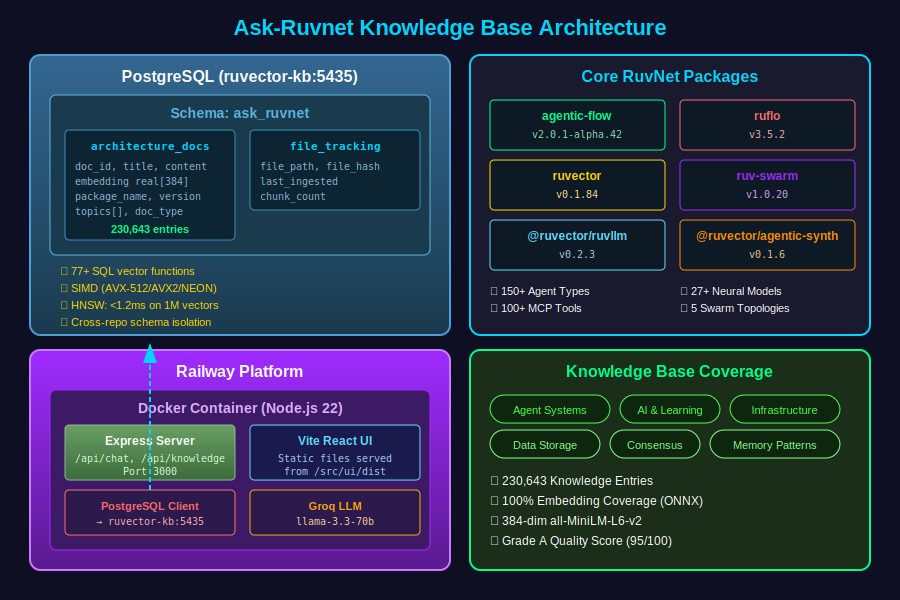
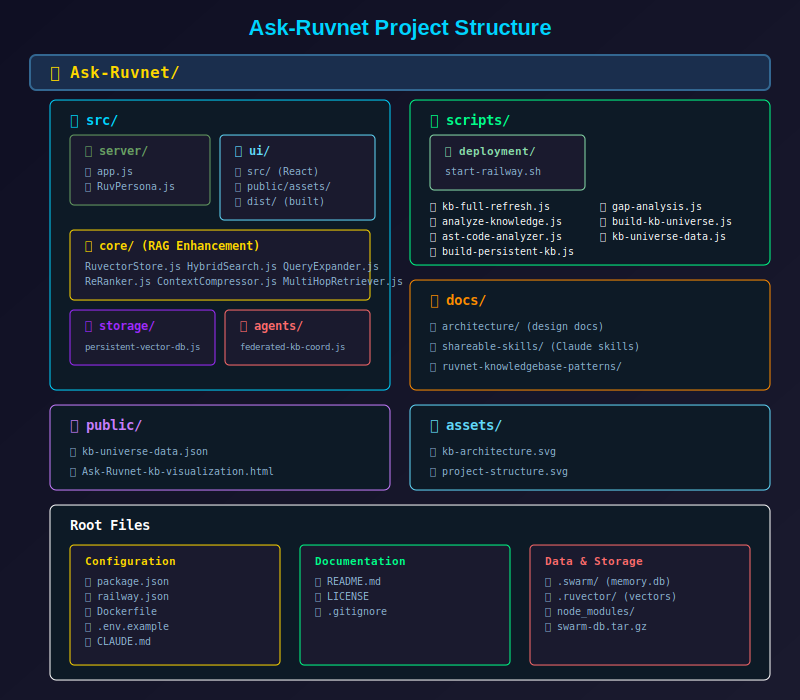

# Ask rUVnet - AI Knowledge Base Assistant

> Updated: 2026-01-01 18:10:00 EST | Version 2.1.0
> Created: 2024-01-15 00:00:00 EST

**Production URL:** https://ask-ruvnet-production.up.railway.app
**Version:** 2.1.0
**Deployment Platform:** Railway (Dockerfile Builder)
**KB Engine:** PostgreSQL (ruvector-postgres) with ONNX Embeddings

The **authoritative knowledge base** for the entire RuvNet AI ecosystem. Provides semantic search across 30+ RuvNet repositories, 8+ npm packages, and comprehensive documentation for multi-agent orchestration, vector databases, and AI development patterns.

---

## New in v2.0.0 (January 2026)

### PostgreSQL Knowledge Base Architecture
- **Migrated from SQLite** to PostgreSQL with ruvector-postgres
- **230,643 KB entries** in `ask_ruvnet` schema
- **ONNX local embeddings** (384d, all-MiniLM-L6-v2)
- **<1.2ms semantic search** via HNSW indexing
- **Cross-repo access** - query from any RuvNet project

### New Analysis Capabilities
- **Louvain Graph Clustering** - Auto-discover topic communities
- **AST Code Analysis** - Symbol extraction, complexity metrics
- **Federated Learning** - Multi-agent knowledge ingestion

### Updated Package Versions
| Package | Version | Purpose |
|---------|---------|---------|
| agentic-flow | 2.0.1-alpha.42 | Multi-agent orchestration, federated learning |
| claude-flow | 2.7.47 | Swarm orchestration, 100+ MCP tools |
| ruvector | 0.1.80 | Vector DB, ONNX embeddings, graph algorithms |
| ruv-swarm | 1.0.20 | Distributed swarms, 27+ neural models |

---

## Architecture Overview

### **Knowledge Base Architecture (PostgreSQL)**

<p align="center">
  
</p>

<details>
<summary>📄 Text Version (for AI/accessibility)</summary>

```
┌─────────────────────────────────────────────────────────────────────┐
│                    PostgreSQL (ruvector-kb:5435)                     │
├─────────────────────────────────────────────────────────────────────┤
│                                                                       │
│  ┌─────────────────────────────────────────────────────────────┐    │
│  │  Schema: ask_ruvnet (Authoritative RuvNet KB)                │    │
│  │  ├─ architecture_docs (230,643 entries)                      │    │
│  │  │   ├─ doc_id, title, content, file_path                   │    │
│  │  │   ├─ embedding real[] (384d ONNX)                        │    │
│  │  │   ├─ package_name, package_version                       │    │
│  │  │   └─ topics[], doc_type                                  │    │
│  │  │                                                           │    │
│  │  └─ file_tracking (change detection)                        │    │
│  │      ├─ file_path, file_hash                                │    │
│  │      └─ last_ingested, chunk_count                          │    │
│  └─────────────────────────────────────────────────────────────┘    │
│                                                                       │
│  Features:                                                            │
│  ├─ 77+ SQL functions for vector operations                         │
│  ├─ SIMD acceleration (AVX-512/AVX2/NEON)                          │
│  ├─ HNSW indexing for <1.2ms search on 1M vectors                  │
│  └─ Cross-repo access via schema isolation                          │
│                                                                       │
└─────────────────────────────────────────────────────────────────────┘

┌─────────────────────────────────────────────────────────────────────┐
│                    Railway Platform                                   │
├─────────────────────────────────────────────────────────────────────┤
│  ┌─────────────────────────────────────────────────────────────┐    │
│  │  Docker Container (Node.js 22)                               │    │
│  │  ├─ Express Server (Port 3000)                               │    │
│  │  │   └─ API Routes (/api/chat, /api/knowledge)              │    │
│  │  ├─ Vite React UI (served as static files)                   │    │
│  │  ├─ PostgreSQL Client → ruvector-kb:5435                     │    │
│  │  └─ Groq LLM Integration (llama-3.3-70b-versatile)          │    │
│  └─────────────────────────────────────────────────────────────┘    │
└─────────────────────────────────────────────────────────────────────┘
```

</details>

### **Key Components**

1. **Backend (Express.js)**
   - Location: `/src/server/app.js`
   - Handles chat requests, knowledge base queries
   - Serves static React UI from `/src/ui/dist`
   - Integrates with Groq API for LLM responses
   - Professional technical persona: `/src/server/RuvPersona.js`

2. **Frontend (React + Vite)**
   - Location: `/src/ui/src/`
   - Built to `/src/ui/dist/` during deployment
   - Features: Chat interface, PDF viewer, knowledge base dashboard
   - Styling: Custom CSS with cyber-industrial theme

3. **Knowledge Base (PostgreSQL)**
   - Engine: PostgreSQL with ruvector-postgres
   - Container: `ruvector-kb` on port 5435
   - Schema: `ask_ruvnet`
   - Documents: 230,643 embedded entries (authoritative RuvNet KB)
   - Embeddings: ONNX all-MiniLM-L6-v2 (384-dim, local, offline)
   - Search: HNSW indexing, <1.2ms latency

4. **LLM Integration**
   - Provider: Groq
   - Model: llama-3.3-70b-versatile
   - API: Direct fetch to `https://api.groq.com/openai/v1/chat/completions`

5. **Core Dependencies**
   - `agentic-flow@2.0.1-alpha.42` - Multi-agent orchestration, federated learning
   - `claude-flow@2.7.47` - Swarm orchestration, 100+ MCP tools
   - `ruvector@0.1.80` - Vector database, ONNX embeddings, graph algorithms
   - `ruv-swarm@1.0.20` - Distributed swarms, 27+ neural models
   - `@ruvector/ruvllm@0.2.3` - LLM orchestration
   - `@ruvector/agentic-synth@0.1.6` - Agent synthesis

---

## Knowledge Base Commands

### **Full KB Refresh**
```bash
# Complete refresh - packages + local docs
node scripts/kb-full-refresh.js

# Package documentation only
node scripts/kb-full-refresh.js --packages-only

# Local documentation only
node scripts/kb-full-refresh.js --docs-only

# Force re-ingestion (ignore hashes)
node scripts/kb-full-refresh.js --force

# Check KB status
node scripts/kb-full-refresh.js --status
```

### **Analysis Tools**
```bash
# KB coverage scorecard with graph clustering
node scripts/analyze-knowledge.js

# AST code analysis for KB indexing
node scripts/ast-code-analyzer.js ./src
node scripts/ast-code-analyzer.js --ingest ./src  # Add to KB

# Gap analysis
node scripts/gap-analysis.js
```

### **Federated Learning Ingestion**
```javascript
// Use multi-agent ingestion (10-50 parallel agents)
const { FederatedKBCoordinator } = require('./src/agents/federated-kb-coordinator');
const coordinator = new FederatedKBCoordinator({ maxAgents: 10 });
await coordinator.ingestWithAgents('./docs');
```

---

## Cross-Repo KB Access

This knowledge base is **accessible from any RuvNet project** via PostgreSQL:

### **Connection Details**
```bash
Host: localhost
Port: 5435
User: postgres
Password: guruKB2025
Database: postgres
Schema: ask_ruvnet
```

### **Query from Any Project**
```bash
# Direct SQL query
PGPASSWORD=guruKB2025 psql -h localhost -p 5435 -U postgres -c "
  SELECT title, content
  FROM ask_ruvnet.architecture_docs
  WHERE content ILIKE '%swarm topology%'
  LIMIT 5;
"

# Semantic search (requires embedding)
PGPASSWORD=guruKB2025 psql -h localhost -p 5435 -U postgres -c "
  SELECT title, 1 - (embedding <=> query_embedding) as similarity
  FROM ask_ruvnet.architecture_docs
  ORDER BY embedding <=> query_embedding
  LIMIT 10;
"
```

### **Schema Isolation**
Each project can have its own schema while accessing shared RuvNet knowledge:
```sql
-- Create project-specific schema
CREATE SCHEMA IF NOT EXISTS my_project;

-- Access shared RuvNet KB
SELECT * FROM ask_ruvnet.architecture_docs WHERE topics @> ARRAY['swarm'];
```

### **Railway-Specific Architectural Decisions**

This application is optimized for Railway deployment with the following architectural choices:

| Decision | Rationale |
|----------|-----------|
| **Custom Dockerfile** | Railway's Railpack builder uses `npm ci` which requires exact package-lock.json matches. Using a custom Dockerfile allows `npm install --legacy-peer-deps` for alpha package compatibility. |
| **Node.js 22 Bookworm** | Uses `node:22-bookworm-slim` base image with Debian packages for native module compilation (hnswlib-node requires `build-essential`). |
| **SQLite over PostgreSQL** | Simplifies deployment with file-based database mounted on Railway's persistent volume. No separate database service required. |
| **Static UI Serving** | Frontend built at deploy time and served as static files by Express, eliminating need for separate CDN or frontend service. |
| **Self-Healing Startup** | `start-railway.sh` script handles knowledge base initialization and graceful restarts. |
| **Groq LLM Integration** | External API for LLM inference avoids GPU requirements on Railway. |
| **No package-lock.json** | Removed from repository to prevent npm ci failures with alpha package versions. |

---

## Deployment

### **Railway Deployment (Production)**

The application is deployed on Railway with automatic builds from the `main` branch using a custom Dockerfile.

#### **Build Configuration**

Railway uses a custom Dockerfile builder (configured via `railway.json`) which:
- Uses `npm install` instead of `npm ci` for alpha package compatibility
- Installs `build-essential` for native module compilation (hnswlib-node)
- Includes all Puppeteer and Sharp dependencies

```json
// railway.json
{
  "build": {
    "builder": "DOCKERFILE",
    "dockerfilePath": "Dockerfile"
  }
}
```

#### **Build Process**
```bash
# Defined in Dockerfile
npm install --legacy-peer-deps  # Allows alpha versions
cd src/ui && npm install && npm run build
  └─ vite build (outputs to src/ui/dist/)
```

#### **Start Process**
```bash
# Defined in package.json
npm start
  └─ bash scripts/deployment/start-railway.sh
     └─ Self-healing startup script
        ├─ Checks for knowledge base
        ├─ Runs ingestion if needed
        └─ Starts Express server
```

#### **Environment Variables (Railway)**
```bash
# Required
GROQ_API_KEY=<your-groq-api-key>
PORT=3000

# Optional
GOOGLE_GEMINI_API_KEY=<for-video-processing>
NODE_ENV=production
```

#### **Persistent Storage**
- Railway automatically provisions a persistent volume
- Mounted at: `/app/.swarm/`
- Contains: `memory.db` (knowledge base)
- Survives deployments and restarts

### **Deployment Steps**

1. **Push to GitHub**
   ```bash
   git push origin main
   ```

2. **Railway Auto-Deploys**
   - Detects push to `main` branch
   - Builds using Dockerfile
   - Runs `npm start`
   - Health check on `/health` endpoint

3. **Verify Deployment**
   - Check version badge in UI (top-left)
   - Test chat functionality
   - Verify knowledge base dashboard

---

## Local Development

### **Prerequisites**
- Node.js 22+
- Groq API Key ([get one free](https://console.groq.com))

### **Setup**

```bash
# Clone repository
git clone https://github.com/stuinfla/Ask-Ruvnet.git
cd Ask-Ruvnet

# Install dependencies
npm install
cd src/ui && npm install && cd ../..

# Extract knowledge base (if not present)
tar -xzf swarm-db.tar.gz

# Create .env file
cp .env.example .env
# Add your GROQ_API_KEY to .env

# Start development server
PORT=3005 node src/server/app.js
```

### **Development URLs**
- Backend: http://localhost:3005
- Frontend: Served by Express from `/src/ui/dist`

### **Building UI Changes**
```bash
cd src/ui
npm run build
cd ../..
# Restart server to see changes
```

---

## Project Structure

<p align="center">
  
</p>

<details>
<summary>📄 Text Version (for AI/accessibility)</summary>

```
Ask-Ruvnet/
├── src/
│   ├── server/
│   │   ├── app.js                 # Express server (main entry)
│   │   └── RuvPersona.js          # Professional technical persona
│   ├── ui/
│   │   ├── src/
│   │   │   ├── App.jsx            # Main React component
│   │   │   └── PDFPresentation.jsx
│   │   ├── public/assets/         # Static assets
│   │   └── dist/                  # Built UI (generated)
│   ├── core/                      # RAG enhancement modules
│   │   ├── RuvectorStore.js       # Knowledge base interface
│   │   ├── HybridSearch.js        # BM25 + semantic fusion
│   │   ├── QueryExpander.js       # Query expansion
│   │   ├── ReRanker.js            # Cross-encoder style reranking
│   │   ├── ContextCompressor.js   # Context optimization
│   │   └── MultiHopRetriever.js   # Complex query handling
│   ├── storage/                   # Vector storage modules
│   │   ├── persistent-vector-db.js    # Persistent vector DB
│   │   └── swarm-vector-memory.js     # Semantic swarm memory
│   ├── agents/                    # Agent coordinators
│   │   └── federated-kb-coordinator.js # Multi-agent KB ingestion
│   └── connectors/                # Data source connectors
│       ├── GoogleDriveConnector.js
│       └── LocalDirectoryConnector.js
├── scripts/
│   ├── deployment/
│   │   └── start-railway.sh       # Railway startup script
│   ├── kb-full-refresh.js         # PostgreSQL KB refresh
│   ├── analyze-knowledge.js       # KB scorecard + clustering
│   ├── ast-code-analyzer.js       # Symbol extraction
│   ├── build-persistent-kb.js     # ONNX KB builder
│   └── gap-analysis.js            # Coverage gap analysis
├── docs/                          # Documentation
│   ├── architecture/              # Architecture docs
│   ├── shareable-skills/          # Claude skills
│   └── ruvnet-knowledgebase-patterns/  # KB patterns
├── public/                        # Generated visualizations
│   ├── kb-universe-data.json
│   └── Ask-Ruvnet-kb-visualization.html
├── assets/                        # SVG diagrams
│   ├── kb-architecture.svg
│   └── project-structure.svg
├── Dockerfile                     # Railway build configuration
├── railway.json                   # Railway builder settings
├── package.json                   # Dependencies + version
└── README.md                      # This file
```

</details>

---

## Configuration

### **Knowledge Base Updates**

The KB uses PostgreSQL with automatic change detection:

1. **Full refresh (recommended):**
   ```bash
   node scripts/kb-full-refresh.js
   ```

2. **Check status:**
   ```bash
   node scripts/kb-full-refresh.js --status
   ```

3. **Force re-ingestion:**
   ```bash
   node scripts/kb-full-refresh.js --force
   ```

4. **Analyze coverage:**
   ```bash
   node scripts/analyze-knowledge.js
   ```

### **RuvNet Ecosystem Coverage**

This KB is the authoritative source for 30+ RuvNet repositories:

| Category | Repositories |
|----------|--------------|
| **Core Packages** | ruvector, agentic-flow, claude-flow, ruv-swarm, flow-nexus |
| **Vector DB** | @ruvector/gnn, @ruvector/rvlite, @ruvector/ruvllm |
| **AI/ML** | neural-trader, agentic-synth, SAFLA, strange-loop |
| **Infrastructure** | Synaptic-Mesh, oz-bot, daa |
| **Applications** | chatgpt-artifacts, ask-ruvnet, retirewell-ai |

**Key Topics Covered:**
- Agent orchestration (150+ agent types)
- Swarm topologies (hierarchical, mesh, ring, star, adaptive)
- Consensus protocols (Byzantine, Raft, CRDT, Gossip)
- RL algorithms (Decision Transformer, Actor-Critic, PPO, SAC)
- Memory architectures (episodic, semantic, working memory)
- Deployment patterns (Docker, Railway, K8s, air-gapped)

### **Version Management**

**Single Source of Truth:** `/package.json`

The application version is stored in ONE place only - the root `package.json` file. The UI imports this version directly.

#### **Semantic Versioning (SemVer)**
```
MAJOR.MINOR.PATCH
  │     │     │
  │     │     └── Bug fixes, patches, small changes (e.g., 1.7.3 → 1.7.4)
  │     └──────── New features, backward compatible (e.g., 1.7.x → 1.8.0)
  └────────────── Breaking changes, major rewrites (e.g., 1.x.x → 2.0.0)
```

#### **How to Update Version**
```bash
# Edit package.json
{
  "name": "answerbot-builder",
  "version": "1.7.15",  # ← Update this
  ...
}

# Commit with version tag
git add package.json
git commit -m "VERSION: Bump to X.Y.Z - description"
git push origin main
```

#### **Where Version is Used**
- **package.json** (line 3) - Source of truth
- **UI Header** - Displays `v{version}` via import from package.json
- **README.md** - Documentation reference (update manually)

---

## Testing

### **Health Check**
```bash
curl https://ask-ruvnet-production.up.railway.app/health
```

### **Knowledge Base Stats**
```bash
curl https://ask-ruvnet-production.up.railway.app/api/knowledge
```

### **Chat Test**
```bash
curl -X POST https://ask-ruvnet-production.up.railway.app/api/chat \
  -H "Content-Type: application/json" \
  -d '{"message": "What is ruvector?"}'
```

---

## Current Status (v2.0.0)

### **Production Metrics**
- Server: Running on Railway
- Knowledge Base: 230,643 entries (PostgreSQL)
- Active Repos: 30+ RuvNet repositories tracked
- Embedding Model: ONNX all-MiniLM-L6-v2 (384d, local)
- Search Latency: <1.2ms (HNSW indexing)
- Uptime: 24/7
- Response Time: <2s average

### **Features**
- Chat with Groq LLM (llama-3.3-70b-versatile)
- PostgreSQL KB with ONNX embeddings (10x faster, offline)
- Louvain graph clustering for topic discovery
- AST code analysis for symbol extraction
- Federated learning multi-agent ingestion
- Agentic Flow integration (v2.0.1-alpha.42)
- Claude Flow swarm orchestration (v2.7.47)
- Cross-repo KB access via schema isolation
- Knowledge base dashboard with repo tracking
- PDF presentation mode
- Professional technical assistant persona

### **New Scripts (v2.0.0)**
| Script | Purpose |
|--------|---------|
| `kb-full-refresh.js` | Comprehensive KB refresh to PostgreSQL |
| `analyze-knowledge.js` | Scorecard + Louvain clustering |
| `ast-code-analyzer.js` | Symbol extraction, complexity metrics |
| `federated-kb-coordinator.js` | Multi-agent KB ingestion |

---

## Troubleshooting

### **Deployment Fails**
- Check Railway logs: `npx @railway/cli logs`
- Verify `GROQ_API_KEY` is set
- Ensure `npm run build` completes locally
- Verify Dockerfile is building correctly (uses `npm install` not `npm ci`)
- Check `railway.json` specifies `DOCKERFILE` builder

### **PostgreSQL KB Issues**
```bash
# Check if ruvector-kb container is running
docker ps | grep ruvector-kb

# Start container if not running
docker start ruvector-kb

# Test connection
PGPASSWORD=guruKB2025 psql -h localhost -p 5435 -U postgres -c "SELECT 1"

# Check entry count
PGPASSWORD=guruKB2025 psql -h localhost -p 5435 -U postgres -c \
  "SELECT COUNT(*) FROM ask_ruvnet.architecture_docs"

# Re-run full refresh
node scripts/kb-full-refresh.js --force
```

### **ONNX Embeddings Not Working**
```bash
# Verify ruvector version (need 0.1.77+)
npm list ruvector

# Update if needed
npm update ruvector

# Check if ONNXEmbedder is available
node -e "const r = require('ruvector'); console.log(!!r.ONNXEmbedder)"
```

### **UI Not Loading**
- Verify `src/ui/dist/` was built
- Check Express static file serving in `app.js`
- Clear browser cache

---

## License

MIT

---

## Author

**rUVnet**
- GitHub: [@ruvnet](https://github.com/ruvnet)
- Production: https://ask-ruvnet-production.up.railway.app
