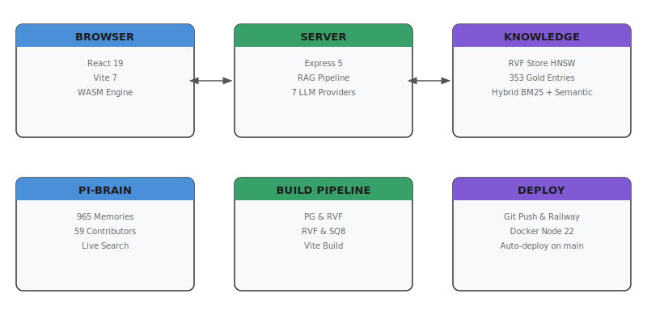
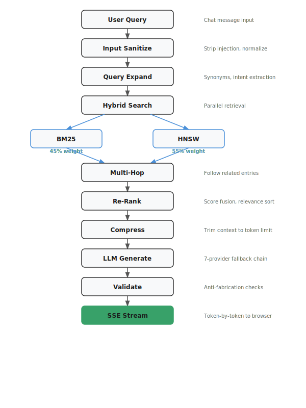
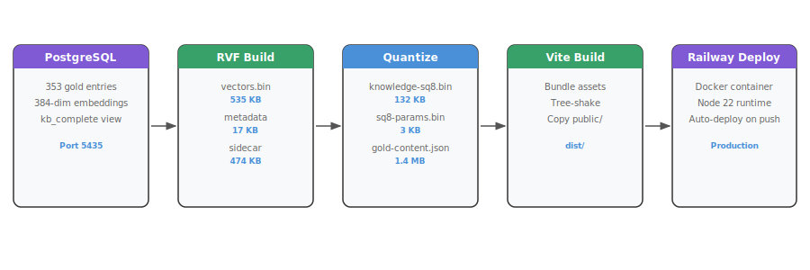
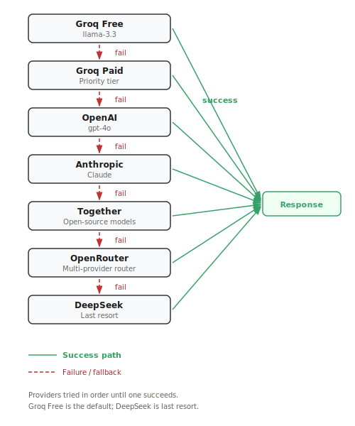
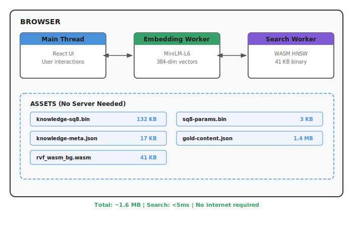
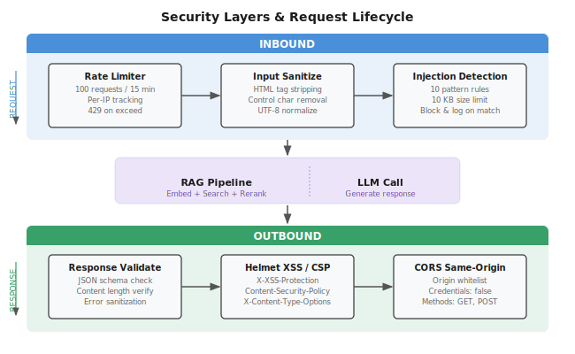
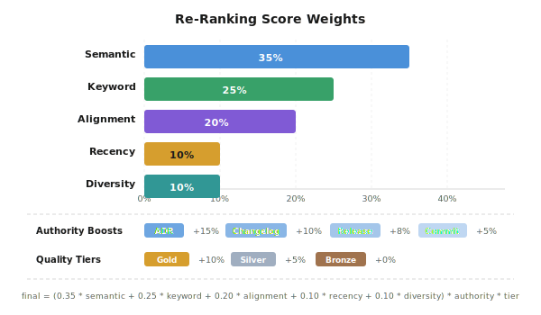
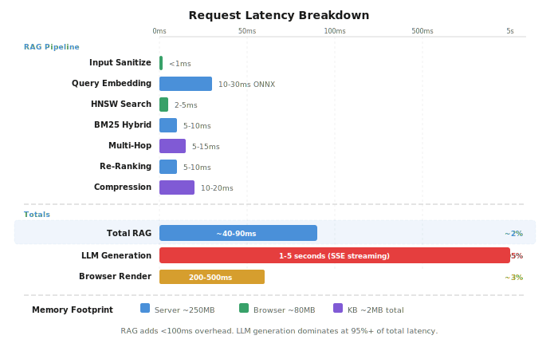
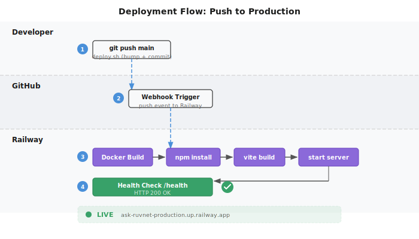

# Ask-RuvNet Architecture
Updated: 2026-03-16 | Version 4.7.x

## System Overview



<details>
<summary>ASCII Version (for AI/accessibility)</summary>

```
┌─────────────────────────────────────────────────────────────────────┐
│                        ASK-RUVNET v4.7                              │
│                                                                     │
│  ┌──────────────┐    ┌──────────────┐    ┌───────────────────────┐ │
│  │   BROWSER     │    │   SERVER     │    │   KNOWLEDGE           │ │
│  │              │    │              │    │                       │ │
│  │  React 19    │◄──►│  Express 5   │◄──►│  RVF Store (HNSW)    │ │
│  │  Vite 7      │SSE │  RAG Pipeline│    │  353 Gold Entries     │ │
│  │  Mermaid 11  │    │  7 LLM Provs │    │  384-dim Embeddings  │ │
│  │  WASM Engine │    │  Security    │    │  Hybrid BM25+Semantic│ │
│  └──────────────┘    └──────────────┘    └───────────────────────┘ │
│                                                                     │
│  ┌──────────────┐    ┌──────────────┐    ┌───────────────────────┐ │
│  │  PI-BRAIN     │    │  BUILD       │    │  DEPLOY               │ │
│  │              │    │  PIPELINE    │    │                       │ │
│  │  965 Memories│    │  PG → RVF    │    │  Git Push → Railway  │ │
│  │  59 Contribs │    │  RVF → SQ8   │    │  Auto-deploy main    │ │
│  │  Live Search │    │  Vite Build  │    │  Docker Node 22      │ │
│  └──────────────┘    └──────────────┘    └───────────────────────┘ │
└─────────────────────────────────────────────────────────────────────┘
```

</details>

## Request Flow (Chat API)



<details>
<summary>ASCII Version (for AI/accessibility)</summary>

```
User Types Question
        │
        ▼
┌───────────────┐
│ Input Sanitize │──► Strip HTML, detect injection, 10KB limit
└───────┬───────┘
        │
        ▼
┌───────────────┐
│ Query Expand   │──► Synonyms (80+ pairs), reformulation, concept extraction
└───────┬───────┘
        │
        ▼
┌───────────────┐     ┌──────────────┐
│ Hybrid Search  │────►│ BM25 (45%)   │──► Keyword matching
│                │     └──────────────┘
│                │     ┌──────────────┐
│                │────►│ HNSW (55%)   │──► Semantic similarity
└───────┬───────┘     └──────────────┘
        │
        ▼
┌───────────────┐
│ Multi-Hop      │──► Decompose complex queries, follow-up searches (max 2 hops)
└───────┬───────┘
        │
        ▼
┌───────────────┐
│ Re-Rank        │──► Semantic 35% + Keyword 25% + Alignment 20% + Recency 10% + Diversity 10%
└───────┬───────┘
        │
        ▼
┌───────────────┐
│ Compress       │──► 24K char limit, preserve code/numbers, source attribution
└───────┬───────┘
        │
        ▼
┌───────────────┐
│ LLM Generate   │──► Groq → OpenAI → Claude → Together → OpenRouter → DeepSeek
└───────┬───────┘
        │
        ▼
┌───────────────┐
│ Validate       │──► Check TL;DR, diagrams, code blocks, tables
└───────┬───────┘
        │
        ▼
  SSE Stream ──────► Browser renders Markdown + Mermaid
```

</details>

## Knowledge Build Pipeline



<details>
<summary>ASCII Version (for AI/accessibility)</summary>

```
┌──────────────────┐     ┌──────────────────┐     ┌──────────────────┐
│   POSTGRESQL      │     │   RVF BUILD       │     │   QUANTIZE        │
│   (localhost:5435)│     │                    │     │                    │
│                    │     │  vectors.bin       │     │  knowledge-sq8.bin │
│  ask_ruvnet.      │────►│  (535KB, Float32)  │────►│  (132KB, Uint8)    │
│  kb_complete      │     │                    │     │                    │
│  353 gold entries │     │  metadata.json     │     │  sq8-params.bin    │
│  384-dim vectors  │     │  (17KB)            │     │  (3KB)             │
│                    │     │                    │     │                    │
│                    │     │  content-sidecar   │     │  knowledge-meta    │
│                    │     │  .json.gz (474KB)  │     │  .json.gz (17KB)   │
└──────────────────┘     └──────────────────┘     └──────────────────┘
                                                            │
                                                            ▼
                                                   ┌──────────────────┐
                                                   │   VITE BUILD      │
                                                   │                    │
                                                   │  src/ui/dist/     │
                                                   │  - index.html     │
                                                   │  - index-*.js     │
                                                   │  - index-*.css    │
                                                   │  - assets/        │
                                                   │    - sq8.bin      │
                                                   │    - params.bin   │
                                                   │    - meta.json.gz │
                                                   │    - wasm/        │
                                                   │    - docs/        │
                                                   └────────┬─────────┘
                                                            │
                                                            ▼
                                                   ┌──────────────────┐
                                                   │   RAILWAY DEPLOY  │
                                                   │                    │
                                                   │  git push main    │
                                                   │  Docker build     │
                                                   │  Node 22-slim     │
                                                   │  Auto-deploy      │
                                                   └──────────────────┘
```

</details>

## LLM Provider Fallback Chain



<details>
<summary>ASCII Version (for AI/accessibility)</summary>

```
┌─────────────┐   ✓   ┌─────────────┐
│ Groq (Free) │──────►│  RESPONSE    │
│ llama-3.3   │       └─────────────┘
└──────┬──────┘
       │ ✗ (rate limit)
       ▼
┌─────────────┐   ✓   ┌─────────────┐
│ Groq (Paid) │──────►│  RESPONSE    │
│ configurable│       └─────────────┘
└──────┬──────┘
       │ ✗
       ▼
┌─────────────┐   ✓   ┌─────────────┐
│   OpenAI     │──────►│  RESPONSE    │
│   gpt-4o    │       └─────────────┘
└──────┬──────┘
       │ ✗
       ▼
┌─────────────┐   ✓   ┌─────────────┐
│  Anthropic   │──────►│  RESPONSE    │
│  Claude      │       └─────────────┘
└──────┬──────┘
       │ ✗
       ▼
┌─────────────┐   ✓   ┌─────────────┐
│  Together    │──────►│  RESPONSE    │
└──────┬──────┘       └─────────────┘
       │ ✗
       ▼
┌─────────────┐   ✓   ┌─────────────┐
│ OpenRouter   │──────►│  RESPONSE    │
└──────┬──────┘       └─────────────┘
       │ ✗
       ▼
┌─────────────┐   ✓   ┌─────────────┐
│  DeepSeek    │──────►│  RESPONSE    │
└─────────────┘       └─────────────┘
```

</details>

## Browser Cognitive Container (Edge-Native)



<details>
<summary>ASCII Version (for AI/accessibility)</summary>

```
┌─────────────────────────────────────────────────┐
│                    BROWSER                        │
│                                                   │
│  ┌───────────┐   ┌───────────┐   ┌───────────┐ │
│  │ Main Thread│   │ Embedding │   │  Search    │ │
│  │           │   │  Worker   │   │  Worker    │ │
│  │ React App │   │           │   │            │ │
│  │ UI Render │   │ MiniLM-L6 │   │ WASM HNSW │ │
│  │ Mermaid   │◄─►│ 384-dim   │◄─►│ 41KB      │ │
│  │           │   │ ONNX/WASM │   │ Kernel    │ │
│  └───────────┘   └───────────┘   └───────────┘ │
│                                                   │
│  ┌─────────────────────────────────────────────┐ │
│  │              ASSETS (No Server Needed)        │ │
│  │                                               │ │
│  │  knowledge-sq8.bin ──── 132KB (353 vectors)  │ │
│  │  sq8-params.bin ──────── 3KB (min/max)       │ │
│  │  knowledge-meta.json ── 17KB (titles, cats)  │ │
│  │  gold-content.json ──── 1.4MB (full text)    │ │
│  │  rvf_wasm_bg.wasm ───── 41KB (search engine) │ │
│  └─────────────────────────────────────────────┘ │
│                                                   │
│  Total: ~1.6MB for complete offline knowledge     │
│  Search latency: <5ms for 353 vectors             │
│  No internet required. No API keys. No backend.   │
└─────────────────────────────────────────────────┘
```

</details>

## Security Layers



<details>
<summary>ASCII Version (for AI/accessibility)</summary>

```
┌───────────────────────────────────────────────┐
│                 INBOUND                        │
│                                                │
│  ┌──────────┐  ┌──────────┐  ┌──────────────┐│
│  │ Rate     │  │ Input    │  │ Injection    ││
│  │ Limiter  │─►│ Sanitize │─►│ Detection    ││
│  │ 100/15m  │  │ HTML strip│  │ 10 patterns  ││
│  │          │  │ Ctrl char │  │ Truncate 10KB││
│  └──────────┘  └──────────┘  └──────────────┘│
└───────────────────────────────────────────────┘
                      │
                      ▼
              ┌──────────────┐
              │  RAG Pipeline │
              │  + LLM Call   │
              └──────────────┘
                      │
                      ▼
┌───────────────────────────────────────────────┐
│                 OUTBOUND                       │
│                                                │
│  ┌──────────┐  ┌──────────┐  ┌──────────────┐│
│  │ Response │  │ Helmet   │  │ CORS         ││
│  │ Validate │─►│ XSS/CSP  │─►│ Same-origin  ││
│  │ Sections │  │ Headers  │  │ Production   ││
│  └──────────┘  └──────────┘  └──────────────┘│
└───────────────────────────────────────────────┘
```

</details>

## Re-Ranking Scoring Model



<details>
<summary>ASCII Version (for AI/accessibility)</summary>

```
┌─────────────────────────────────────────────────────┐
│                  RE-RANKING SCORE                     │
│                                                       │
│  ┌──────────────┐                                    │
│  │ Semantic  35% │████████████████████                │
│  │ (embedding)   │                                    │
│  ├──────────────┤                                    │
│  │ Keyword   25% │██████████████                      │
│  │ (BM25 overlap)│                                    │
│  ├──────────────┤                                    │
│  │ Alignment 20% │███████████                         │
│  │ (query-doc)   │                                    │
│  ├──────────────┤                                    │
│  │ Recency   10% │█████                               │
│  │ (freshness)   │                                    │
│  ├──────────────┤                                    │
│  │ Diversity 10% │█████                               │
│  │ (source mix)  │                                    │
│  └──────────────┘                                    │
│                                                       │
│  + Authority Boosts: ADR +15%, Changelog +10%,       │
│    Release +8%, Commit +5%                            │
│  + Quality Tiers: Gold +10%, Silver +5%, Bronze +0%  │
└─────────────────────────────────────────────────────┘
```

</details>

## File Structure

```
Ask-Ruvnet/
├── src/
│   ├── core/                          # Knowledge & RAG Engine
│   │   ├── RvfStore.js                #   RVF runtime (HNSW search)
│   │   ├── HybridSearch.js            #   BM25 + semantic fusion
│   │   ├── QueryExpander.js           #   80+ synonym pairs
│   │   ├── ReRanker.js                #   5-signal scoring
│   │   ├── ContextCompressor.js       #   24K char optimizer
│   │   ├── MultiHopRetriever.js       #   Complex query decomposition
│   │   ├── ResponseValidator.js       #   Output quality checks
│   │   ├── TextChunker.js             #   Document segmentation
│   │   └── RecencyBoost.js            #   Temporal weighting
│   ├── server/
│   │   ├── app.js                     #   Express server (2,200 lines)
│   │   └── RuvPersona.js             #   AI persona + system prompt
│   └── ui/
│       ├── src/
│       │   ├── App.jsx                #   Single-file React app
│       │   └── App.css                #   All styling
│       ├── public/
│       │   ├── assets/
│       │   │   ├── wasm/              #   WASM binaries
│       │   │   ├── docs/              #   Videos, PDFs
│       │   │   ├── product/           #   SVG story illustrations
│       │   │   ├── knowledge-sq8.bin  #   Quantized vectors (132KB)
│       │   │   └── pi-*.js            #   Pi-Brain demo scripts
│       │   ├── rvf-engine.html        #   WASM cognitive container
│       │   ├── knowledge-universe.html #  3D KB visualization
│       │   ├── pi-executable-knowledge.html
│       │   ├── pi-living-graph.html
│       │   └── pi-learning-loop.html
│       ├── vite.config.js
│       └── package.json
├── scripts/
│   ├── build-lean-rvf.mjs            #   PG → RVF vectors
│   ├── build-quantized-rvf.mjs       #   Float32 → SQ8
│   └── deployment/
│       ├── deploy.sh                  #   Version bump + push
│       └── start-railway.sh           #   Railway entrypoint
├── docs/
│   ├── ARCHITECTURE-DIAGRAMS.md       #   This file
│   └── PI-BRAIN-DEMOS-PLAN.md        #   Demo narrative plan
├── .ruvector/knowledge-base/          #   Built vectors
├── knowledge.rvf                      #   HNSW container (535KB)
├── content-sidecar.json.gz            #   Text content (474KB)
├── Dockerfile                         #   Railway build
└── package.json                       #   Server dependencies
```

## Performance Profile



<details>
<summary>ASCII Version (for AI/accessibility)</summary>

```
┌──────────────────────────────────────────────────┐
│              LATENCY BREAKDOWN                    │
│                                                    │
│  Input Sanitize    ■ <1ms                         │
│  Query Embedding   ■■■■ 10-30ms (ONNX)           │
│  HNSW Search       ■■ 2-5ms                       │
│  BM25 Hybrid       ■■■ 5-10ms                     │
│  Multi-Hop         ■■■ 5-15ms                      │
│  Re-Ranking        ■■■ 5-10ms                      │
│  Compression       ■■■■ 10-20ms                    │
│  ─────────────────────────────────                │
│  Total RAG         ■■■■■■■■■■ ~40-90ms            │
│                                                    │
│  LLM Generation    ■■■■■■■■■■■■■■■■ 1-5 seconds  │
│  (first token)                                     │
│                                                    │
│  Browser Render    ■■■■■ 200-500ms                 │
│  (Markdown+Mermaid)                                │
└──────────────────────────────────────────────────┘

Memory:  Server ~250MB | Browser ~80MB | KB ~2MB total
```

</details>

## Deployment Flow



<details>
<summary>ASCII Version (for AI/accessibility)</summary>

```
Developer                  GitHub                Railway
   │                         │                      │
   │  git push main          │                      │
   │────────────────────────►│                      │
   │                         │  webhook trigger     │
   │                         │─────────────────────►│
   │                         │                      │
   │                         │                      │ Docker build
   │                         │                      │ npm install
   │                         │                      │ vite build
   │                         │                      │ start server
   │                         │                      │
   │                         │                      │ Health check
   │                         │                      │ /health → 200
   │                         │                      │
   │            LIVE at ask-ruvnet-production.up.railway.app
   │                         │                      │
```

</details>
