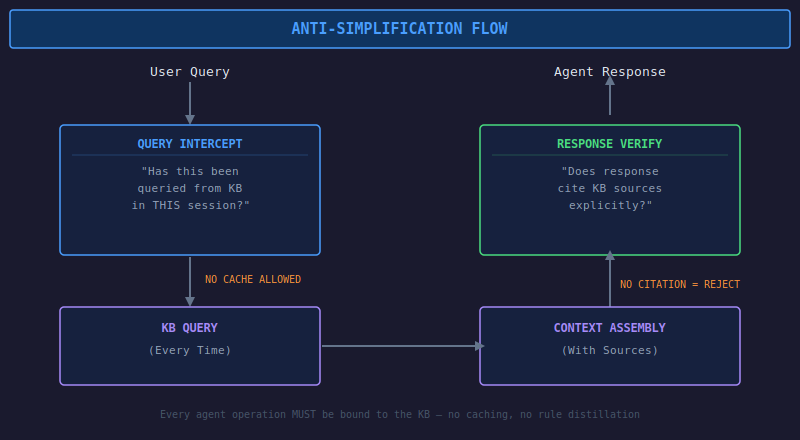
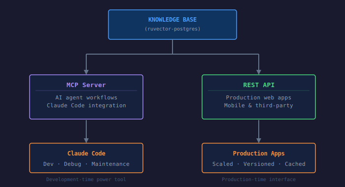
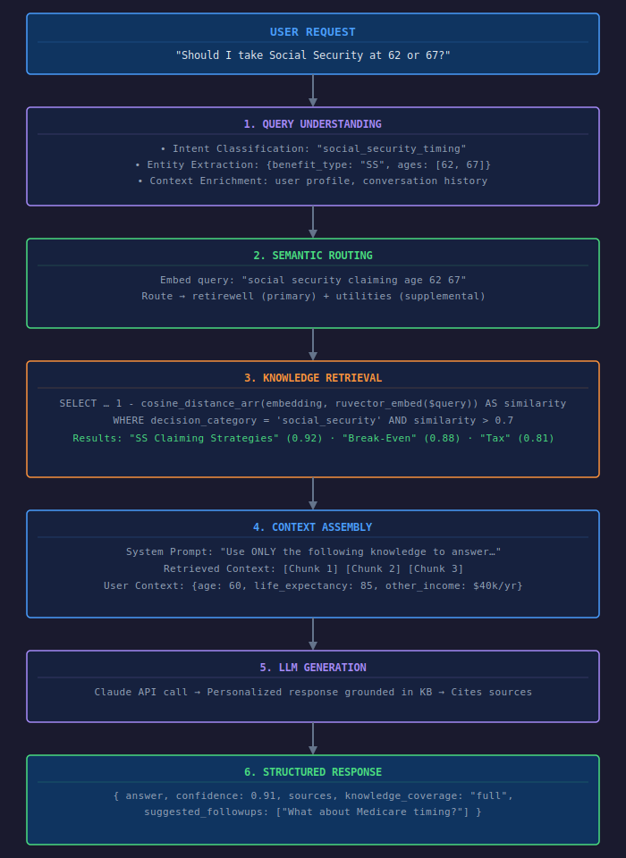
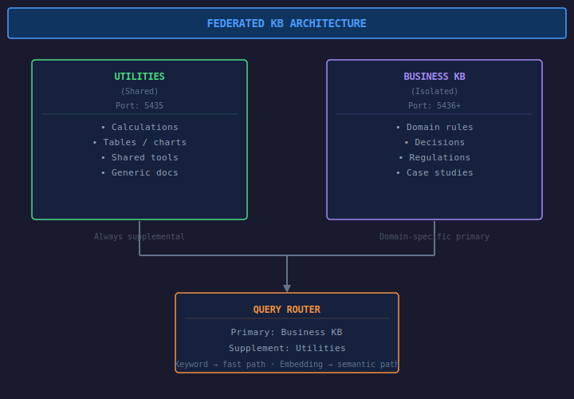
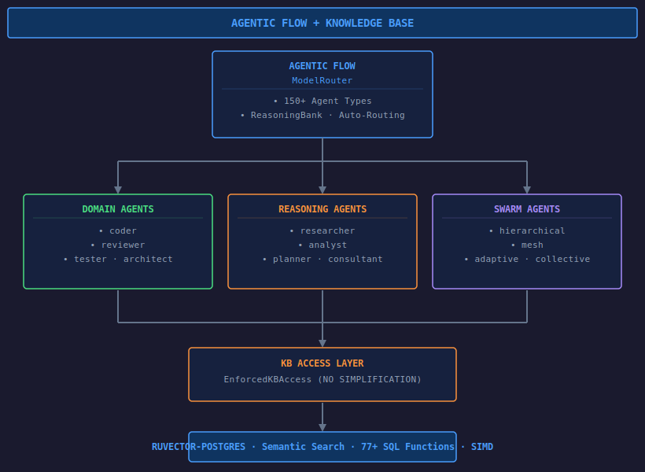
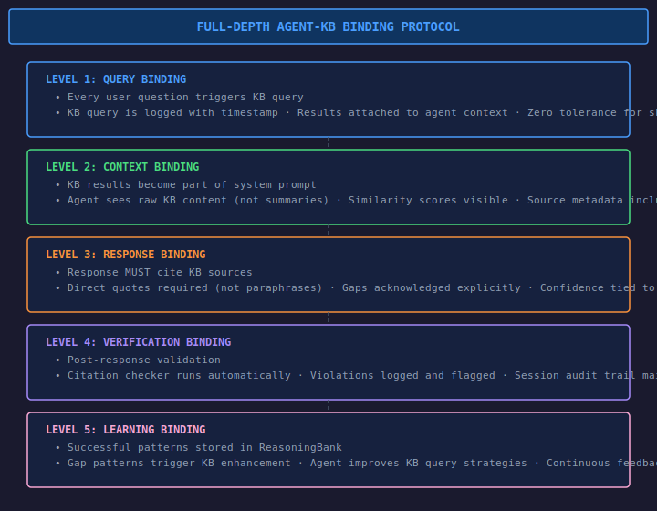
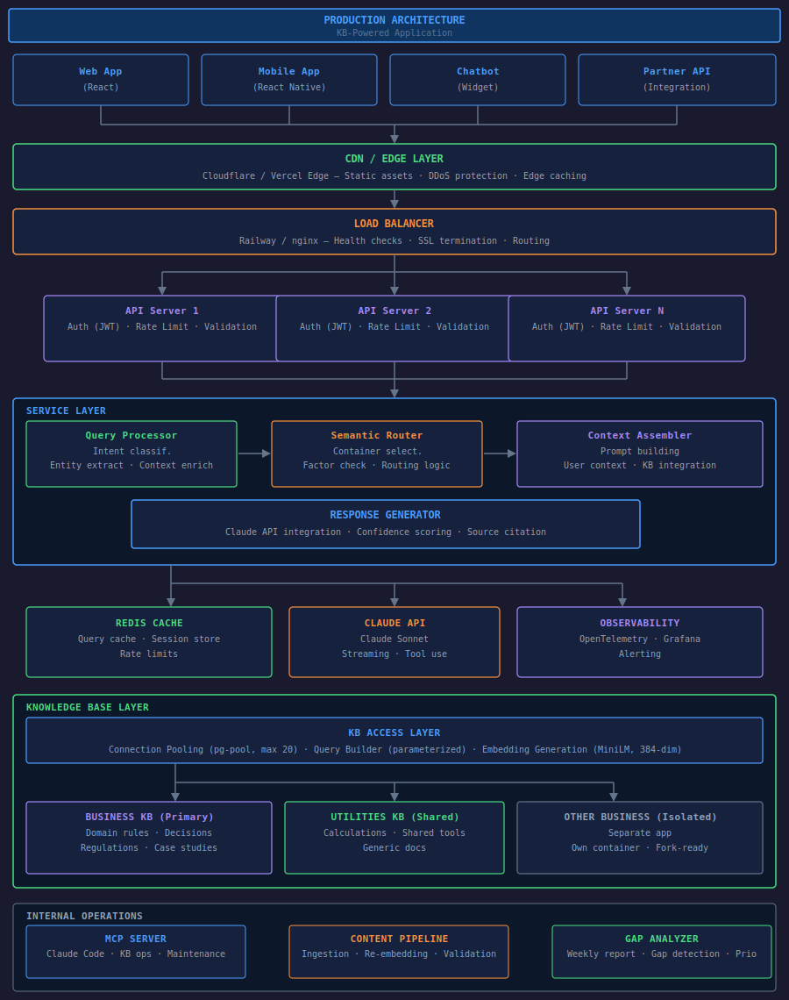
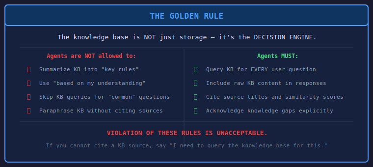

# Knowledge Base-Powered Application Architecture

Updated: 2025-12-30 08:50:00 EST | Version 2.0.0
Created: 2025-12-30 08:40:00 EST

## Overview

This document describes the optimal architecture for building **hyper-intelligent agentic applications** powered by RuvVector/RuvLLM knowledge bases. These patterns enable world-class applications where the knowledge base serves as the decision engine, not just a data store.

**CRITICAL**: This architecture enforces full KB utilization. Agents MUST NOT simplify, distill, or reduce KB knowledge into low-level rules. Every decision must flow through the KB with full-depth retrieval.

---

## Table of Contents

1. [Core Principles](#core-principles)
2. [⚠️ Anti-Simplification Architecture](#anti-simplification-architecture)
3. [Access Patterns: MCP vs REST](#access-patterns-mcp-vs-rest)
4. [Knowledge Base Schema Design](#knowledge-base-schema-design)
5. [RAG Pipeline Architecture](#rag-pipeline-architecture)
6. [Cross-Container Search Patterns](#cross-container-search-patterns)
7. [Confidence Scoring & Fallbacks](#confidence-scoring--fallbacks)
8. [🤖 Agentic Flow KB Integration](#agentic-flow-kb-integration)
9. [🔮 Ruflo KB Integration](#ruflo-kb-integration)
10. [🧠 Full-Depth Agent-KB Binding](#full-depth-agent-kb-binding)
11. [Production Architecture](#production-architecture)
12. [Implementation Guide](#implementation-guide)
13. [Tech Stack Recommendations](#tech-stack-recommendations)

---

## Core Principles

### The KB as Engine, Not Storage

Traditional databases store data. KB-powered applications use the knowledge base as a **decision engine**:

```
Traditional:  User → API → Database → Raw Data → Display
KB-Powered:   User → API → KB Engine → Contextual Intelligence → Personalized Response
```

### Key Differentiators

| Aspect | Traditional DB | KB-Powered Engine |
|--------|---------------|-------------------|
| Query | Exact match | Semantic similarity |
| Response | Raw records | Contextual answers |
| Personalization | Manual rules | Automatic via embeddings |
| Knowledge gaps | Errors/nulls | Graceful fallbacks |
| Updates | Schema migrations | Continuous ingestion |

---

## ⚠️ Anti-Simplification Architecture

### The Problem: Rule Distillation

AI agents (including Claude) have a tendency to **simplify** complex knowledge bases into simple rules. This creates massive problems:

```
❌ WRONG (Rule Distillation):
  Agent reads KB → Extracts "5 key rules" → Ignores KB → Uses rules only

  Result: Lost nuance, missed edge cases, outdated information, wrong answers

✅ CORRECT (Full KB Utilization):
  Agent receives query → Queries KB in real-time → Uses full context → Generates response

  Result: Complete information, current data, proper nuance, correct answers
```

### Why This Happens

1. **Token optimization** - Agents try to compress knowledge to save context
2. **Pattern matching** - Agents identify "common patterns" and stop querying
3. **Lazy caching** - Agents remember previous queries and skip KB consultation
4. **Abstract summarization** - Agents create mental models instead of using source data

### The Solution: Mandatory KB Binding

Every agent operation MUST be **bound to the KB** with verification:



<details>
<summary>ASCII Version (for AI/accessibility)</summary>

```
┌─────────────────────────────────────────────────────────────────────────────┐
│                        ANTI-SIMPLIFICATION FLOW                              │
└─────────────────────────────────────────────────────────────────────────────┘

    User Query                         Agent Response
        │                                    ▲
        │                                    │
        ▼                                    │
┌───────────────────┐              ┌───────────────────┐
│  QUERY INTERCEPT  │              │  RESPONSE VERIFY  │
│                   │              │                   │
│ "Has this been    │              │ "Does response    │
│  queried from KB  │              │  cite KB sources  │
│  in THIS session?"│              │  explicitly?"     │
└─────────┬─────────┘              └─────────┬─────────┘
          │                                  │
          │ NO CACHE ALLOWED                 │ NO CITATION = REJECT
          ▼                                  ▲
┌───────────────────┐              ┌───────────────────┐
│  KB QUERY         │──────────────│  CONTEXT ASSEMBLY │
│  (Every Time)     │              │  (With Sources)   │
└───────────────────┘              └───────────────────┘
```

</details>

### Enforcement Rules

#### Rule 1: No Rule Memory
```yaml
# FORBIDDEN PATTERNS (Claude MUST NOT do these):
- "Based on my understanding of the KB..."
- "The key principles are..."
- "From what I recall from the knowledge base..."
- "The rules state that..."

# REQUIRED PATTERNS (Claude MUST do these):
- "Let me query the knowledge base for [specific query]..."
- "The KB returns [X results] for this question..."
- "According to [KB source]: [exact content]..."
- "The knowledge base entry '[title]' states: ..."
```

#### Rule 2: Citation Required
```javascript
// Every response MUST include explicit citations
{
    answer: "...",
    kb_queries_made: ["query1", "query2"],  // REQUIRED: What was searched
    kb_results_used: [                       // REQUIRED: What was found
        { title: "...", source: "...", similarity: 0.92 }
    ],
    kb_coverage: "full|partial|gap",         // REQUIRED: Did KB answer this?
    raw_kb_content: "..."                    // REQUIRED: Actual KB text used
}
```

#### Rule 3: No Summarization Without Source
```yaml
# FORBIDDEN:
"The KB says you should claim Social Security at 67."

# REQUIRED:
"The KB entry 'Social Security Claiming Age: 62 vs 67 vs 70' (source: SSA,
confidence: high) states: 'CLAIM AT 67 (Full Retirement Age for those born
1960+): Receive 100% of full benefit. Break-even age vs 62: approximately 78.
Best if: average life expectancy, balanced approach.'"
```

### Implementation: KB Query Wrapper

```javascript
/**
 * MANDATORY KB Query Wrapper
 * All agent KB access MUST go through this wrapper
 * Prevents caching, enforces logging, requires citation
 */
class EnforcedKBAccess {
    constructor(kbClient, sessionId) {
        this.kb = kbClient;
        this.sessionId = sessionId;
        this.queryLog = [];
        this.NO_CACHE = true;  // Cache is FORBIDDEN
    }

    /**
     * Query KB with enforcement
     * @throws Error if query is too similar to recent query (anti-caching)
     */
    async query(queryText, options = {}) {
        // Log this query
        const queryRecord = {
            timestamp: Date.now(),
            sessionId: this.sessionId,
            query: queryText,
            options
        };

        // Execute KB search (NO CACHE)
        const results = await this.kb.search({
            query: queryText,
            ...options,
            // Force fresh query
            nocache: true,
            timestamp: Date.now()
        });

        // Record results
        queryRecord.resultCount = results.length;
        queryRecord.topSimilarity = results[0]?.similarity || 0;
        queryRecord.titles = results.map(r => r.title);
        this.queryLog.push(queryRecord);

        // Return with metadata for citation
        return {
            results,
            metadata: {
                queryId: queryRecord.timestamp,
                mustCite: true,
                sources: results.map(r => ({
                    title: r.title,
                    source: r.source,
                    similarity: r.similarity,
                    content: r.content  // Include full content for citation
                }))
            }
        };
    }

    /**
     * Verify response includes proper citations
     */
    verifyCitation(response, queryMetadata) {
        const errors = [];

        if (!response.kb_queries_made || response.kb_queries_made.length === 0) {
            errors.push("VIOLATION: No KB queries recorded");
        }

        if (!response.kb_results_used || response.kb_results_used.length === 0) {
            errors.push("VIOLATION: No KB results cited");
        }

        if (!response.raw_kb_content) {
            errors.push("VIOLATION: No raw KB content included");
        }

        if (errors.length > 0) {
            throw new Error(`Anti-Simplification Violation:\n${errors.join('\n')}`);
        }

        return true;
    }

    /**
     * Get session query log for audit
     */
    getQueryLog() {
        return this.queryLog;
    }
}
```

### Session Prompt Enforcement

Every agent session MUST include this system prompt:

```markdown
## MANDATORY KB UTILIZATION RULES

You are operating with a knowledge base that contains expert-level information.
You MUST follow these rules WITHOUT EXCEPTION:

1. **NO RULE MEMORY**: You are FORBIDDEN from:
   - Summarizing the KB into "key rules" or "main principles"
   - Using phrases like "based on my understanding of the KB"
   - Relying on previous queries instead of querying again
   - Creating mental models or abstractions of KB content

2. **QUERY FOR EVERYTHING**: Every user question MUST trigger:
   - At least one KB query using the provided query tools
   - Explicit citation of KB results in your response
   - Inclusion of raw KB content in your response

3. **CITATION REQUIRED**: Your responses MUST include:
   - The exact KB query you made
   - The titles and sources of results you used
   - Direct quotes from KB content (not paraphrases)
   - Similarity scores to show relevance

4. **NO PARAPHRASING WITHOUT SOURCE**: You MUST NOT:
   - Summarize KB content without quoting it
   - Make claims without citing the specific KB entry
   - Use general knowledge when KB contains the answer

5. **FRESH QUERIES EVERY TIME**: Even if you queried something earlier:
   - Query again for each new user question
   - Do not assume previous results are still relevant
   - The KB may have been updated

VIOLATION OF THESE RULES IS UNACCEPTABLE.
If you cannot cite a KB source, say "I need to query the knowledge base for this."
```

### Verification Checklist

Before any agent response is finalized, verify:

- [ ] Response contains `kb_queries_made` array
- [ ] Response contains `kb_results_used` array with titles and sources
- [ ] Response contains `raw_kb_content` with actual KB text
- [ ] Response does NOT contain phrases like "based on my understanding"
- [ ] Response does NOT contain summarized rules without citations
- [ ] If KB had no results, response acknowledges the knowledge gap

---

## Access Patterns: MCP vs REST

### When to Use Each



<details>
<summary>ASCII Version (for AI/accessibility)</summary>

```
                    KNOWLEDGE BASE (ruvector-postgres)
                            │
            ┌───────────────┴───────────────┐
            │                               │
      ┌─────┴─────┐                   ┌─────┴─────┐
      │    MCP    │                   │   REST    │
      │  Server   │                   │    API    │
      └─────┬─────┘                   └─────┬─────┘
            │                               │
      ┌─────┴─────┐                   ┌─────┴─────┐
      │  Claude   │                   │ Production│
      │   Code    │                   │   Apps    │
      └───────────┘                   └───────────┘
```

</details>

### MCP (Model Context Protocol)

**Best for:**
- AI agent workflows
- Claude Code integration
- Development and debugging
- KB maintenance operations
- Automated content ingestion

**Characteristics:**
- Native tool integration with Claude
- Session context preservation
- Zero HTTP overhead (direct calls)
- Real-time development feedback

**Example tools:**
```
kb_search      - Semantic search with auto-routing
kb_search_all  - Cross-container federated search
kb_add         - Add entries with auto-embedding
kb_containers  - List all KB containers
kb_stats       - Container statistics
kb_status      - Connection health check
```

### REST API

**Best for:**
- Production web applications
- Mobile applications
- Third-party integrations
- Public API consumers
- Horizontal scaling requirements

**Characteristics:**
- Universal client support (any language)
- Load balancing and CDN caching
- Rate limiting and authentication
- API versioning
- Distributed tracing

**Example endpoints:**
```
POST /api/v1/advisor/ask      - Main RAG query endpoint
POST /api/v1/advisor/clarify  - Follow-up for missing context
GET  /api/v1/knowledge/search - Direct KB search
GET  /api/v1/knowledge/categories - Decision categories
POST /api/v1/admin/ingest     - Add new content
GET  /api/v1/admin/gaps       - Knowledge gap report
```

### Recommendation: Use Both

MCP and REST are **complementary, not competing**:
- **MCP** = Development-time power tool
- **REST** = Production-time interface

Both share the same underlying KB connection layer.

---

## Knowledge Base Schema Design

### Basic Schema (Semantic Search Only)

```sql
CREATE TABLE knowledge (
    id SERIAL PRIMARY KEY,
    title TEXT NOT NULL,
    content TEXT NOT NULL,
    source TEXT,
    embedding real[] NOT NULL,
    created_at TIMESTAMP DEFAULT NOW()
);
```

### Enhanced Schema (Decision Support)

For applications that need to power decision trees and personalized recommendations:

```sql
CREATE TABLE knowledge (
    id SERIAL PRIMARY KEY,

    -- Core content
    title TEXT NOT NULL,
    content TEXT NOT NULL,
    source TEXT,

    -- Semantic search (384-dimensional for MiniLM)
    embedding real[] NOT NULL,

    -- Decision tree metadata
    decision_category TEXT,              -- 'social_security', 'medicare', '401k'
    decision_factors JSONB,              -- {"age": true, "income": true, "health": false}
    prerequisite_decisions TEXT[],       -- ['marital_status', 'has_pension']
    outcome_type TEXT,                   -- 'numeric_comparison', 'yes_no', 'tradeoff'
    confidence_level TEXT DEFAULT 'medium', -- 'high', 'medium', 'low'

    -- Freshness and compliance
    effective_date DATE,
    expiration_date DATE,
    last_verified TIMESTAMP,
    regulatory_source TEXT,              -- 'IRS', 'SSA', 'CMS'

    -- Versioning
    version INTEGER DEFAULT 1,
    previous_version_id INTEGER REFERENCES knowledge(id),

    created_at TIMESTAMP DEFAULT NOW(),
    updated_at TIMESTAMP DEFAULT NOW()
);

-- Indexes for efficient querying
CREATE INDEX idx_decision_category ON knowledge(decision_category);
CREATE INDEX idx_decision_factors ON knowledge USING GIN(decision_factors);
CREATE INDEX idx_effective_date ON knowledge(effective_date);
CREATE INDEX idx_confidence ON knowledge(confidence_level);
```

### Example Decision-Support Entry

```sql
INSERT INTO retirewell.knowledge (
    title,
    content,
    embedding,
    decision_category,
    decision_factors,
    outcome_type,
    confidence_level,
    regulatory_source
) VALUES (
    'Social Security Claiming Age: 62 vs 67 vs 70',
    'The decision to claim Social Security benefits depends on several factors:

    CLAIM AT 62:
    - Receive 70% of full benefit
    - Break-even age vs 67: approximately 78
    - Best if: shorter life expectancy, immediate cash need, other income sources

    CLAIM AT 67 (Full Retirement Age for those born 1960+):
    - Receive 100% of full benefit
    - Break-even age vs 62: approximately 78
    - Best if: average life expectancy, balanced approach

    DELAY TO 70:
    - Receive 124% of full benefit (8% increase per year from 67)
    - Break-even age vs 67: approximately 82
    - Best if: excellent health, other income to bridge, maximize survivor benefit',

    ruvector_embed('Social Security claiming age 62 67 70 break-even analysis'),
    'social_security',
    '{"age": true, "life_expectancy": true, "other_income": true, "marital_status": true}',
    'tradeoff',
    'high',
    'SSA'
);
```

---

## RAG Pipeline Architecture

### Complete Flow



<details>
<summary>ASCII Version (for AI/accessibility)</summary>

```
┌─────────────────────────────────────────────────────────────────┐
│                         USER REQUEST                             │
│          "Should I take Social Security at 62 or 67?"           │
└─────────────────────────────────────────────────────────────────┘
                                │
                                ▼
┌─────────────────────────────────────────────────────────────────┐
│                    1. QUERY UNDERSTANDING                        │
│  ┌───────────────────────────────────────────────────────────┐  │
│  │ • Intent Classification: "social_security_timing"         │  │
│  │ • Entity Extraction: {benefit_type: "SS", ages: [62, 67]} │  │
│  │ • Context Enrichment: user profile, conversation history  │  │
│  └───────────────────────────────────────────────────────────┘  │
└─────────────────────────────────────────────────────────────────┘
                                │
                                ▼
┌─────────────────────────────────────────────────────────────────┐
│                    2. SEMANTIC ROUTING                           │
│  ┌───────────────────────────────────────────────────────────┐  │
│  │ Embed query: "social security claiming age 62 67"         │  │
│  │                                                           │  │
│  │ Route to containers:                                      │  │
│  │   • retirewell (primary) → domain-specific knowledge      │  │
│  │   • utilities (supplemental) → calculations, tables       │  │
│  └───────────────────────────────────────────────────────────┘  │
└─────────────────────────────────────────────────────────────────┘
                                │
                                ▼
┌─────────────────────────────────────────────────────────────────┐
│                    3. KNOWLEDGE RETRIEVAL                        │
│  ┌───────────────────────────────────────────────────────────┐  │
│  │ SELECT title, content, source, confidence_level,          │  │
│  │        1 - cosine_distance_arr(embedding,                 │  │
│  │            ruvector_embed($query)) AS similarity          │  │
│  │ FROM retirewell.knowledge                                 │  │
│  │ WHERE decision_category = 'social_security'               │  │
│  │   AND 1 - cosine_distance_arr(...) > 0.7                  │  │
│  │ ORDER BY similarity DESC                                  │  │
│  │ LIMIT 5;                                                  │  │
│  │                                                           │  │
│  │ Results:                                                  │  │
│  │   1. "SS Claiming Strategies" (0.92 similarity, high)     │  │
│  │   2. "Break-Even Analysis" (0.88 similarity, high)        │  │
│  │   3. "Tax Implications" (0.81 similarity, medium)         │  │
│  └───────────────────────────────────────────────────────────┘  │
└─────────────────────────────────────────────────────────────────┘
                                │
                                ▼
┌─────────────────────────────────────────────────────────────────┐
│                    4. CONTEXT ASSEMBLY                           │
│  ┌───────────────────────────────────────────────────────────┐  │
│  │ System Prompt:                                            │  │
│  │   "You are a retirement planning assistant. Use ONLY the  │  │
│  │    following knowledge to answer. If knowledge doesn't    │  │
│  │    cover the question, say so explicitly."                │  │
│  │                                                           │  │
│  │ Retrieved Context:                                        │  │
│  │   [Chunk 1: Social Security Claiming Strategies...]       │  │
│  │   [Chunk 2: Break-Even Analysis...]                       │  │
│  │   [Chunk 3: Tax Implications...]                          │  │
│  │                                                           │  │
│  │ User Context:                                             │  │
│  │   {age: 60, life_expectancy: 85, other_income: $40k/yr}   │  │
│  └───────────────────────────────────────────────────────────┘  │
└─────────────────────────────────────────────────────────────────┘
                                │
                                ▼
┌─────────────────────────────────────────────────────────────────┐
│                    5. LLM GENERATION                             │
│  ┌───────────────────────────────────────────────────────────┐  │
│  │ Claude API call with assembled context                    │  │
│  │ → Generates personalized response grounded in KB          │  │
│  │ → Includes confidence indicators                          │  │
│  │ → Cites sources from KB                                   │  │
│  └───────────────────────────────────────────────────────────┘  │
└─────────────────────────────────────────────────────────────────┘
                                │
                                ▼
┌─────────────────────────────────────────────────────────────────┐
│                    6. STRUCTURED RESPONSE                        │
│  {                                                              │
│    "answer": "Based on your situation, here's the trade-off...",│
│    "confidence": 0.91,                                          │
│    "sources": ["SS Claiming Strategies", "Break-Even Analysis"],│
│    "knowledge_coverage": "full",                                │
│    "suggested_followups": ["What about Medicare timing?"]       │
│  }                                                              │
└─────────────────────────────────────────────────────────────────┘
```

</details>

### Implementation Code

```javascript
// RAG Pipeline Implementation
class KBPoweredRAG {
    constructor(kbClient, llmClient) {
        this.kb = kbClient;
        this.llm = llmClient;
    }

    async process(query, userContext) {
        // 1. Query Understanding
        const parsed = await this.parseQuery(query);

        // 2. Semantic Routing
        const containers = this.routeToContainers(parsed.intent);

        // 3. Knowledge Retrieval
        const knowledge = await this.retrieveKnowledge(
            query,
            containers,
            parsed.category
        );

        // 4. Context Assembly
        const context = this.assembleContext(
            knowledge,
            userContext,
            parsed
        );

        // 5. LLM Generation
        const response = await this.llm.generate(context);

        // 6. Structure Response
        return {
            answer: response.text,
            confidence: this.calculateConfidence(knowledge),
            sources: knowledge.map(k => k.title),
            knowledge_coverage: this.assessCoverage(knowledge, parsed),
            suggested_followups: this.generateFollowups(parsed, userContext)
        };
    }

    async retrieveKnowledge(query, containers, category) {
        const results = [];

        for (const container of containers) {
            const hits = await this.kb.search({
                container: container.id,
                query: query,
                filters: category ? { decision_category: category } : {},
                limit: container.isPrimary ? 5 : 3,
                minSimilarity: container.isPrimary ? 0.7 : 0.65
            });

            results.push(...hits.map(h => ({
                ...h,
                container: container.id,
                isPrimary: container.isPrimary
            })));
        }

        return results.sort((a, b) => b.similarity - a.similarity);
    }

    calculateConfidence(knowledge) {
        if (knowledge.length === 0) return 0;

        const avgSimilarity = knowledge.reduce((s, k) => s + k.similarity, 0) / knowledge.length;
        const topConfidence = this.confidenceScore(knowledge[0]?.confidence_level);
        const coverage = Math.min(knowledge.length / 3, 1); // Expect ~3 sources

        return (avgSimilarity * 0.5) + (topConfidence * 0.3) + (coverage * 0.2);
    }

    confidenceScore(level) {
        return { high: 1.0, medium: 0.7, low: 0.4 }[level] || 0.5;
    }
}
```

---

## Cross-Container Search Patterns

### Federated Architecture



<details>
<summary>ASCII Version (for AI/accessibility)</summary>

```
┌─────────────────────────────────────────────────────────────────┐
│                    FEDERATED KB ARCHITECTURE                     │
└─────────────────────────────────────────────────────────────────┘

    ┌─────────────────┐      ┌─────────────────┐
    │   UTILITIES     │      │   BUSINESS KB   │
    │   (Shared)      │      │   (Isolated)    │
    │   Port: 5435    │      │   Port: 5436+   │
    ├─────────────────┤      ├─────────────────┤
    │ • Calculations  │      │ • Domain rules  │
    │ • Tables/charts │      │ • Decisions     │
    │ • Shared tools  │      │ • Regulations   │
    │ • Generic docs  │      │ • Case studies  │
    └────────┬────────┘      └────────┬────────┘
             │                        │
             └───────────┬────────────┘
                         │
                         ▼
              ┌─────────────────────┐
              │   QUERY ROUTER      │
              │                     │
              │ Primary: Business   │
              │ Supplement: Utils   │
              └─────────────────────┘
```

</details>

### Query Routing Logic

```javascript
// Semantic router for multi-container search
class SemanticRouter {
    constructor(containerRegistry) {
        this.containers = containerRegistry;
    }

    async route(query, userContext) {
        const queryLower = query.toLowerCase();

        // Keyword-based routing (fast path)
        for (const [id, config] of Object.entries(this.containers)) {
            for (const keyword of config.keywords) {
                if (queryLower.includes(keyword)) {
                    return this.buildRouteResult(id, config);
                }
            }
        }

        // Embedding-based routing (semantic path)
        return await this.semanticRoute(query);
    }

    buildRouteResult(primaryId, primaryConfig) {
        return {
            primary: { id: primaryId, ...primaryConfig, isPrimary: true },
            supplemental: this.getSupplementalContainers(primaryId)
        };
    }

    getSupplementalContainers(primaryId) {
        // Utilities is always supplemental for business KBs
        if (primaryId !== 'utilities') {
            return [{ id: 'utilities', ...this.containers.utilities, isPrimary: false }];
        }
        return [];
    }
}
```

### Cross-Container Search Example

```javascript
async function federatedSearch(query, router, kbClient) {
    const route = await router.route(query);
    const results = { primary: [], supplemental: [] };

    // Primary search (higher threshold, more results)
    results.primary = await kbClient.search({
        container: route.primary.id,
        query: query,
        limit: 5,
        minSimilarity: 0.7
    });

    // Supplemental search if needed
    const needsSupplemental =
        results.primary.length < 3 ||
        results.primary[0]?.similarity < 0.85;

    if (needsSupplemental && route.supplemental.length > 0) {
        for (const supp of route.supplemental) {
            const suppResults = await kbClient.search({
                container: supp.id,
                query: query,
                limit: 3,
                minSimilarity: 0.65
            });
            results.supplemental.push(...suppResults);
        }
    }

    return results;
}
```

---

## Confidence Scoring & Fallbacks

### Four-Tier Confidence System

| Tier | Confidence | User Experience |
|------|------------|-----------------|
| **High** | > 85% | Direct, confident answer with citations |
| **Medium** | 60-85% | Answer with caveats and uncertainty acknowledgment |
| **Low** | 40-60% | Partial answer + recommend professional consultation |
| **Gap** | < 40% | Acknowledge gap, provide alternatives |

### Implementation

```javascript
class ConfidenceHandler {
    async generateResponse(query, kbResults, userContext) {
        const confidence = this.calculateConfidence(kbResults);

        if (confidence > 0.85) {
            return this.highConfidenceResponse(query, kbResults, userContext);
        }

        if (confidence > 0.6) {
            return this.mediumConfidenceResponse(query, kbResults, userContext);
        }

        if (confidence > 0.4) {
            return this.lowConfidenceResponse(query, kbResults, userContext);
        }

        return this.gapResponse(query, userContext);
    }

    highConfidenceResponse(query, results, context) {
        return {
            type: 'confident',
            answer: this.generateAnswer(results, context),
            confidence: this.calculateConfidence(results),
            sources: results.map(r => r.title),
            disclaimer: null
        };
    }

    mediumConfidenceResponse(query, results, context) {
        return {
            type: 'cautioned',
            answer: this.generateAnswer(results, context),
            confidence: this.calculateConfidence(results),
            sources: results.map(r => r.title),
            disclaimer: 'This information is general guidance. Your specific situation may vary.'
        };
    }

    lowConfidenceResponse(query, results, context) {
        return {
            type: 'partial',
            answer: this.generatePartialAnswer(results, context),
            confidence: this.calculateConfidence(results),
            sources: results.map(r => r.title),
            disclaimer: 'This is partial information. Consider consulting a professional.',
            professional_referral: true
        };
    }

    gapResponse(query, context) {
        return {
            type: 'gap',
            answer: `I don't have specific information about "${query}" in my knowledge base.`,
            confidence: 0,
            sources: [],
            suggested_actions: [
                'Consult a certified professional',
                'Check official sources',
                'Ask about related topics I can help with'
            ],
            related_topics: this.findRelatedTopics(query)
        };
    }
}
```

### Knowledge Gap Tracking

```sql
-- Track queries that result in low-confidence responses
CREATE TABLE knowledge_gaps (
    id SERIAL PRIMARY KEY,
    query TEXT NOT NULL,
    query_embedding real[],
    best_match_similarity FLOAT,
    category_attempted TEXT,
    user_context JSONB,
    gap_type TEXT,  -- 'no_match', 'low_confidence', 'missing_factors'
    created_at TIMESTAMP DEFAULT NOW()
);

-- Index for analysis
CREATE INDEX idx_gap_type ON knowledge_gaps(gap_type);
CREATE INDEX idx_gap_created ON knowledge_gaps(created_at);

-- Weekly gap analysis view
CREATE VIEW gap_analysis AS
SELECT
    date_trunc('week', created_at) AS week,
    gap_type,
    COUNT(*) AS gap_count,
    array_agg(DISTINCT LEFT(query, 100)) AS sample_queries
FROM knowledge_gaps
WHERE created_at > NOW() - INTERVAL '30 days'
GROUP BY 1, 2
ORDER BY 1 DESC, 3 DESC;
```

---

## 🤖 Agentic Flow KB Integration

Agentic Flow provides **150+ specialized agents** and **213 MCP tools**. This section shows how to bind these agents to the knowledge base for full-depth utilization.

### Architecture: Agent-KB Binding



<details>
<summary>ASCII Version (for AI/accessibility)</summary>

```
┌─────────────────────────────────────────────────────────────────────────────┐
│                    AGENTIC FLOW + KNOWLEDGE BASE                             │
└─────────────────────────────────────────────────────────────────────────────┘

                              ┌─────────────────────┐
                              │   AGENTIC FLOW      │
                              │   ModelRouter       │
                              │                     │
                              │ • 150+ Agent Types  │
                              │ • ReasoningBank     │
                              │ • Auto-Routing      │
                              └──────────┬──────────┘
                                         │
            ┌────────────────────────────┼────────────────────────────┐
            │                            │                            │
            ▼                            ▼                            ▼
┌───────────────────┐      ┌───────────────────┐      ┌───────────────────┐
│  DOMAIN AGENTS    │      │  REASONING AGENTS │      │  SWARM AGENTS     │
│                   │      │                   │      │                   │
│ • coder           │      │ • researcher      │      │ • hierarchical    │
│ • reviewer        │      │ • analyst         │      │ • mesh            │
│ • tester          │      │ • planner         │      │ • adaptive        │
│ • architect       │      │ • consultant      │      │ • collective-intel│
└─────────┬─────────┘      └─────────┬─────────┘      └─────────┬─────────┘
          │                          │                          │
          └──────────────────────────┼──────────────────────────┘
                                     │
                         ┌───────────▼───────────┐
                         │   KB ACCESS LAYER     │
                         │                       │
                         │  EnforcedKBAccess     │
                         │  (NO SIMPLIFICATION)  │
                         └───────────┬───────────┘
                                     │
                         ┌───────────▼───────────┐
                         │   RUVECTOR-POSTGRES   │
                         │                       │
                         │  • Semantic Search    │
                         │  • 77+ SQL Functions  │
                         │  • SIMD Acceleration  │
                         └───────────────────────┘
```

</details>

### ReasoningBank + KB Integration

Agentic Flow's ReasoningBank provides learning memory. Combined with the KB:

```javascript
import { ModelRouter } from 'agentic-flow/router';
import * as reasoningbank from 'agentic-flow/reasoningbank';

// Initialize with KB binding
await reasoningbank.initialize();

class KBBoundAgentFlow {
    constructor(kbClient) {
        this.router = new ModelRouter();
        this.kb = new EnforcedKBAccess(kbClient, 'agentic-flow-session');
    }

    /**
     * Every agent query MUST go through KB first
     */
    async processQuery(query, agentType = 'consultant') {
        // Step 1: MANDATORY KB Query
        const kbResult = await this.kb.query(query, {
            limit: 5,
            minSimilarity: 0.65
        });

        // Step 2: Build KB-grounded context
        const context = this.buildKBContext(kbResult);

        // Step 3: Route to appropriate agent WITH KB context
        const response = await this.router.chat({
            model: 'auto',
            priority: 'quality',
            messages: [
                {
                    role: 'system',
                    content: `You are a ${agentType} agent. You MUST use the following
                    knowledge base information. DO NOT make claims without citing these sources.

                    ${context}`
                },
                { role: 'user', content: query }
            ]
        });

        // Step 4: Store in ReasoningBank for learning
        await reasoningbank.storeMemory(
            `query:${Date.now()}`,
            JSON.stringify({
                query,
                kbSources: kbResult.metadata.sources,
                response: response.text
            }),
            { namespace: 'kb-interactions' }
        );

        // Step 5: Return with MANDATORY citations
        return {
            answer: response.text,
            kb_queries_made: [query],
            kb_results_used: kbResult.metadata.sources,
            raw_kb_content: kbResult.results.map(r => r.content).join('\n\n'),
            agent_used: agentType,
            model_used: response.model
        };
    }

    buildKBContext(kbResult) {
        if (kbResult.results.length === 0) {
            return 'NO KNOWLEDGE BASE RESULTS. You must acknowledge this gap.';
        }

        return kbResult.results.map((r, i) => `
### KB Source ${i + 1}: ${r.title}
**Similarity**: ${(r.similarity * 100).toFixed(1)}%
**Source**: ${r.source}
**Content**:
${r.content}
        `).join('\n---\n');
    }
}
```

### Agent Types for KB-Powered Applications

| Agent Type | KB Role | Use Case |
|------------|---------|----------|
| `researcher` | Deep KB mining | Find all related information on a topic |
| `analyst` | KB synthesis | Compare multiple KB entries |
| `consultant` | KB advisory | Answer questions using KB |
| `planner` | KB-informed planning | Create plans grounded in KB knowledge |
| `reviewer` | KB validation | Verify claims against KB |
| `coder` | KB-guided implementation | Code based on KB specifications |

### Multi-Agent KB Workflow

```javascript
/**
 * Multi-agent workflow where ALL agents share KB binding
 */
async function multiAgentKBWorkflow(userRequest, kbClient) {
    const kb = new EnforcedKBAccess(kbClient, 'multi-agent-session');
    const agents = new KBBoundAgentFlow(kbClient);

    // Phase 1: Research agent queries KB exhaustively
    const research = await agents.processQuery(
        `Find all knowledge related to: ${userRequest}`,
        'researcher'
    );

    // Phase 2: Analyst synthesizes KB findings
    const analysis = await agents.processQuery(
        `Analyze these findings for ${userRequest}: ${research.raw_kb_content}`,
        'analyst'
    );

    // Phase 3: Consultant provides recommendation
    const recommendation = await agents.processQuery(
        `Based on this analysis, recommend action for ${userRequest}`,
        'consultant'
    );

    // All agents MUST cite KB sources
    return {
        research: research,
        analysis: analysis,
        recommendation: recommendation,
        total_kb_queries: 3,
        all_sources_cited: [
            ...research.kb_results_used,
            ...analysis.kb_results_used,
            ...recommendation.kb_results_used
        ]
    };
}
```

---

## 🔮 Ruflo KB Integration

Ruflo provides **enterprise orchestration** with Hive Mind, 64 specialized agents, and AgentDB. This section shows deep KB integration.

### Hive Mind + KB Architecture


<details>
<summary>ASCII Version (for AI/accessibility)</summary>

```
┌─────────────────────────────────────────────────────────────────────────────┐
│                       RUFLO HIVE MIND + KB                                   │
└─────────────────────────────────────────────────────────────────────────────┘

                         ┌─────────────────────────┐
                         │      HIVE MIND          │
                         │    (Queen Coordinator)  │
                         │                         │
                         │ KB Memory: Persistent   │
                         │ Consensus: Byzantine    │
                         └───────────┬─────────────┘
                                     │
            ┌────────────────────────┼────────────────────────────┐
            │                        │                            │
            ▼                        ▼                            ▼
┌───────────────────┐      ┌───────────────────┐      ┌───────────────────┐
│  WORKER AGENTS    │      │  SCOUT AGENTS     │      │  SPECIALIST AGENTS│
│                   │      │                   │      │                   │
│  Task Execution   │      │  KB Exploration   │      │  Domain Expertise │
│  KB Grounding     │      │  Gap Detection    │      │  KB Authority     │
└─────────┬─────────┘      └─────────┬─────────┘      └─────────┬─────────┘
          │                          │                          │
          └──────────────────────────┼──────────────────────────┘
                                     │
                    ┌────────────────┼────────────────┐
                    │                │                │
                    ▼                ▼                ▼
         ┌─────────────────┐ ┌─────────────────┐ ┌─────────────────┐
         │  CLAUDE FLOW    │ │   AGENTDB       │ │  RUVECTOR KB    │
         │  MEMORY         │ │   (Vector)      │ │  (PostgreSQL)   │
         │                 │ │                 │ │                 │
         │ .swarm/memory.db│ │ 164x faster     │ │ 77+ functions   │
         └─────────────────┘ └─────────────────┘ └─────────────────┘
```

</details>

### Ruflo Memory + KB Sync

```bash
# Store KB interaction in Ruflo memory
npx ruflo@latest memory store "kb/last-query" \
    "Query: 'social security timing' | Results: 3 entries | Top: 92% similarity"

# Query memory for KB usage patterns
npx ruflo@latest memory query "kb/" --recent

# Export KB interaction history
npx ruflo@latest memory export --namespace kb --format json
```

### Hive Mind KB-Powered Workflow

```javascript
/**
 * Hive Mind swarm where ALL agents are KB-bound
 */
async function hiveMindKBSwarm(objective, kbClient) {
    const kb = new EnforcedKBAccess(kbClient, 'hive-mind-session');

    // Initialize swarm with KB awareness
    const swarm = await initializeHiveMind({
        topology: 'hierarchical',
        maxAgents: 8,
        kbBinding: kb  // ALL agents inherit KB binding
    });

    // Queen coordinates with KB consultation
    const plan = await swarm.queen.plan(objective, {
        requireKBValidation: true,  // Plan MUST cite KB
        kbNamespaces: ['retirewell', 'utilities']
    });

    // Workers execute with mandatory KB grounding
    const results = await swarm.execute(plan, {
        workerConfig: {
            preTask: async (task) => {
                // BEFORE each task: Query KB
                const kbContext = await kb.query(task.description);
                task.kbContext = kbContext;
            },
            postTask: async (task, result) => {
                // AFTER each task: Verify KB citation
                kb.verifyCitation(result, task.kbContext.metadata);

                // Store in memory for learning
                await rufloMemory.store(
                    `task/${task.id}`,
                    JSON.stringify({
                        task: task.description,
                        kbUsed: task.kbContext.metadata.sources,
                        result
                    })
                );
            }
        }
    });

    return results;
}
```

### Ruflo Commands with KB

```bash
# Spawn KB-grounded swarm
npx ruflo@latest swarm "Analyze retirement options" --claude \
    --kb-container retirewell \
    --enforce-citations

# Query KB before spawning agents
npx ruflo@latest kb query "social security timing" \
    --container retirewell \
    --limit 5

# Hive mind with KB validation
npx ruflo@latest hive-mind spawn "Create retirement plan" --claude \
    --require-kb \
    --no-simplification
```

### Hooks for KB Enforcement

```javascript
// .claude/hooks/kb-enforcement.js
module.exports = {
    'pre-task': async ({ task }) => {
        // Ensure KB query is planned
        if (!task.kbQuery) {
            console.warn('WARNING: Task has no KB query planned');
            task.kbQuery = task.description;  // Auto-add KB query
        }
    },

    'post-task': async ({ task, result }) => {
        // Verify KB citations exist
        if (!result.kb_results_used || result.kb_results_used.length === 0) {
            throw new Error(
                `KB ENFORCEMENT VIOLATION: Task "${task.description}" ` +
                `completed without KB citations. This is not allowed.`
            );
        }
    },

    'session-end': async ({ session }) => {
        // Audit KB usage for session
        const kbQueries = session.queryLog.filter(q => q.type === 'kb');
        const avgCitations = session.results.reduce(
            (sum, r) => sum + (r.kb_results_used?.length || 0), 0
        ) / session.results.length;

        console.log(`Session KB Stats:
            Total KB Queries: ${kbQueries.length}
            Average Citations/Response: ${avgCitations.toFixed(1)}
            Sessions with Gaps: ${session.gaps.length}
        `);
    }
};
```

---

## 🧠 Full-Depth Agent-KB Binding

This section defines the complete binding protocol that ensures agents NEVER simplify KB content.

### The Binding Protocol



<details>
<summary>ASCII Version (for AI/accessibility)</summary>

```
┌─────────────────────────────────────────────────────────────────────────────┐
│                    FULL-DEPTH AGENT-KB BINDING PROTOCOL                      │
└─────────────────────────────────────────────────────────────────────────────┘

LEVEL 1: QUERY BINDING
├── Every user question triggers KB query
├── KB query is logged with timestamp
├── Results are attached to agent context
└── Zero tolerance for skipped queries

LEVEL 2: CONTEXT BINDING
├── KB results become part of system prompt
├── Agent sees raw KB content (not summaries)
├── Similarity scores visible to agent
└── Source metadata included

LEVEL 3: RESPONSE BINDING
├── Response MUST cite KB sources
├── Direct quotes required (not paraphrases)
├── Gaps must be acknowledged explicitly
└── Confidence tied to KB coverage

LEVEL 4: VERIFICATION BINDING
├── Post-response validation
├── Citation checker runs automatically
├── Violations logged and flagged
└── Session audit trail maintained

LEVEL 5: LEARNING BINDING
├── Successful patterns stored in ReasoningBank
├── Gap patterns trigger KB enhancement
├── Agent improves KB query strategies
└── Continuous feedback loop
```

</details>

### Complete Implementation

```javascript
/**
 * FullDepthKBBinding - The complete agent-KB binding system
 * Ensures NO simplification, NO rule distillation, FULL KB utilization
 */
class FullDepthKBBinding {
    constructor(config) {
        this.kb = new EnforcedKBAccess(config.kbClient, config.sessionId);
        this.agentFlow = new KBBoundAgentFlow(config.kbClient);
        this.ruflo = config.rufloMemory;
        this.violations = [];
        this.stats = {
            queries: 0,
            citations: 0,
            gaps: 0,
            violations: 0
        };
    }

    /**
     * Process any request with full KB binding
     */
    async process(request, options = {}) {
        const {
            agentType = 'consultant',
            requiredSimilarity = 0.65,
            minSources = 1
        } = options;

        // LEVEL 1: Query Binding
        this.stats.queries++;
        const kbResult = await this.kb.query(request, {
            limit: 5,
            minSimilarity: requiredSimilarity
        });

        // Check for knowledge gap
        if (kbResult.results.length < minSources) {
            this.stats.gaps++;
            return this.handleKnowledgeGap(request, kbResult);
        }

        // LEVEL 2: Context Binding
        const boundContext = this.createBoundContext(kbResult);

        // LEVEL 3: Response Binding
        const response = await this.generateBoundResponse(
            request,
            boundContext,
            agentType
        );

        // LEVEL 4: Verification Binding
        const verification = this.verifyBinding(response, kbResult);
        if (!verification.valid) {
            this.violations.push(verification);
            this.stats.violations++;
            throw new Error(`KB Binding Violation: ${verification.reason}`);
        }

        // LEVEL 5: Learning Binding
        await this.recordLearning(request, kbResult, response);

        return response;
    }

    createBoundContext(kbResult) {
        return {
            systemPrompt: `
## MANDATORY KNOWLEDGE BASE CONTEXT

You are bound to the following knowledge base content. You MUST:
1. Use ONLY this information to answer
2. Quote directly from sources
3. Cite the source title for each claim
4. Acknowledge if information is insufficient

---

${kbResult.results.map((r, i) => `
### SOURCE ${i + 1}: ${r.title}
- **Relevance**: ${(r.similarity * 100).toFixed(1)}%
- **Origin**: ${r.source}
- **Confidence**: ${r.confidence_level || 'standard'}

**CONTENT**:
${r.content}
`).join('\n---\n')}

---

DO NOT make any claims not supported by the above sources.
DO NOT summarize these into "key rules" - use the full content.
            `,
            sources: kbResult.metadata.sources,
            rawContent: kbResult.results.map(r => r.content).join('\n\n')
        };
    }

    async generateBoundResponse(request, context, agentType) {
        const response = await this.agentFlow.router.chat({
            model: 'auto',
            priority: 'quality',
            messages: [
                { role: 'system', content: context.systemPrompt },
                { role: 'user', content: request }
            ]
        });

        return {
            answer: response.text,
            kb_queries_made: [request],
            kb_results_used: context.sources,
            raw_kb_content: context.rawContent,
            agent_type: agentType,
            model: response.model,
            timestamp: Date.now()
        };
    }

    verifyBinding(response, kbResult) {
        const errors = [];

        // Check for citation
        if (!response.kb_results_used || response.kb_results_used.length === 0) {
            errors.push('No KB sources cited');
        }

        // Check for raw content inclusion
        if (!response.raw_kb_content) {
            errors.push('Raw KB content not included');
        }

        // Check for forbidden patterns in answer
        const forbidden = [
            'based on my understanding',
            'the key principles are',
            'from what I recall',
            'generally speaking',
            'in my knowledge'
        ];
        const lowerAnswer = response.answer.toLowerCase();
        for (const pattern of forbidden) {
            if (lowerAnswer.includes(pattern)) {
                errors.push(`Forbidden pattern: "${pattern}"`);
            }
        }

        // Check that response mentions at least one source title
        const sourceTitles = kbResult.results.map(r => r.title.toLowerCase());
        const mentionsSource = sourceTitles.some(title =>
            lowerAnswer.includes(title.substring(0, 20).toLowerCase())
        );
        if (!mentionsSource && kbResult.results.length > 0) {
            errors.push('Response does not reference any KB source titles');
        }

        return {
            valid: errors.length === 0,
            reason: errors.join('; '),
            errors
        };
    }

    async recordLearning(request, kbResult, response) {
        // Store in Ruflo memory
        if (this.ruflo) {
            await this.ruflo.store(
                `kb-interaction/${Date.now()}`,
                JSON.stringify({
                    request,
                    kbSources: kbResult.metadata.sources.length,
                    topSimilarity: kbResult.results[0]?.similarity,
                    responseLength: response.answer.length,
                    citationsIncluded: response.kb_results_used.length
                })
            );
        }

        // Store in ReasoningBank for agent learning
        await reasoningbank.storeMemory(
            `successful-kb-interaction:${Date.now()}`,
            JSON.stringify({
                queryPattern: request.substring(0, 100),
                effectiveKBQuery: true,
                sourcesUsed: response.kb_results_used.length
            }),
            { namespace: 'kb-learning' }
        );
    }

    handleKnowledgeGap(request, kbResult) {
        return {
            answer: `I searched the knowledge base for "${request}" but found insufficient information (${kbResult.results.length} results with similarity below threshold). This is a knowledge gap that should be addressed. I cannot provide a reliable answer without KB backing.`,
            kb_queries_made: [request],
            kb_results_used: kbResult.metadata.sources,
            raw_kb_content: kbResult.results.map(r => r.content).join('\n\n') || 'NO CONTENT',
            knowledge_gap: true,
            gap_details: {
                query: request,
                resultsFound: kbResult.results.length,
                bestSimilarity: kbResult.results[0]?.similarity || 0
            }
        };
    }

    getStats() {
        return {
            ...this.stats,
            citationsPerQuery: this.stats.citations / this.stats.queries || 0,
            violationRate: this.stats.violations / this.stats.queries || 0,
            gapRate: this.stats.gaps / this.stats.queries || 0
        };
    }
}

// Export for use in applications
module.exports = { FullDepthKBBinding, EnforcedKBAccess, KBBoundAgentFlow };
```

### Usage Example

```javascript
// Initialize full-depth binding
const binding = new FullDepthKBBinding({
    kbClient: ruvectorClient,
    sessionId: 'retirement-advisor-session',
    rufloMemory: rufloMemory
});

// Process user request with full KB enforcement
try {
    const result = await binding.process(
        "When should I claim Social Security?",
        {
            agentType: 'consultant',
            requiredSimilarity: 0.7,
            minSources: 2
        }
    );

    console.log('Answer:', result.answer);
    console.log('KB Sources Used:', result.kb_results_used);
    console.log('Raw KB Content:', result.raw_kb_content.substring(0, 500));
} catch (error) {
    if (error.message.includes('KB Binding Violation')) {
        console.error('Agent tried to bypass KB:', error.message);
    }
}

// Get session stats
console.log('Session Stats:', binding.getStats());
```

---

## Production Architecture

### Complete System Diagram



<details>
<summary>ASCII Version (for AI/accessibility)</summary>

```
┌─────────────────────────────────────────────────────────────────────────────────┐
│                              PRODUCTION ARCHITECTURE                             │
│                         KB-Powered Application (Example: RetireWell)             │
└─────────────────────────────────────────────────────────────────────────────────┘

                                 EXTERNAL CLIENTS
    ┌──────────────┐    ┌──────────────┐    ┌──────────────┐    ┌──────────────┐
    │   Web App    │    │  Mobile App  │    │   Chatbot    │    │  Partner API │
    │   (React)    │    │ (React Nat.) │    │  (Widget)    │    │  Integration │
    └──────┬───────┘    └──────┬───────┘    └──────┬───────┘    └──────┬───────┘
           └───────────────────┴───────────────────┴───────────────────┘
                                         │
                                         ▼
┌─────────────────────────────────────────────────────────────────────────────────┐
│                            CDN / EDGE LAYER                                      │
│                         (Cloudflare Edge / CDN)                                  │
│                    Static assets, DDoS protection, edge caching                  │
└─────────────────────────────────────────────────────────────────────────────────┘
                                         │
                                         ▼
┌─────────────────────────────────────────────────────────────────────────────────┐
│                            LOAD BALANCER                                         │
│                           (Railway / nginx)                                      │
│                   Health checks, SSL termination, routing                        │
└─────────────────────────────────────────────────────────────────────────────────┘
                                         │
                    ┌────────────────────┼────────────────────┐
                    ▼                    ▼                    ▼
          ┌─────────────────┐  ┌─────────────────┐  ┌─────────────────┐
          │   API Server 1  │  │   API Server 2  │  │   API Server N  │
          │                 │  │                 │  │                 │
          │ • Auth (JWT)    │  │ • Auth (JWT)    │  │ • Auth (JWT)    │
          │ • Rate Limit    │  │ • Rate Limit    │  │ • Rate Limit    │
          │ • Validation    │  │ • Validation    │  │ • Validation    │
          └────────┬────────┘  └────────┬────────┘  └────────┬────────┘
                   └────────────────────┼────────────────────┘
                                        │
                                        ▼
┌─────────────────────────────────────────────────────────────────────────────────┐
│                              SERVICE LAYER                                       │
│                                                                                  │
│  ┌──────────────────┐  ┌──────────────────┐  ┌──────────────────┐              │
│  │ Query Processor  │  │ Semantic Router  │  │ Context Assembler│              │
│  │                  │  │                  │  │                  │              │
│  │ • Intent class.  │→│ • Container sel. │→│ • Prompt building│              │
│  │ • Entity extract │  │ • Factor check   │  │ • User context   │              │
│  │ • Context enrich │  │ • Routing logic  │  │ • KB integration │              │
│  └──────────────────┘  └──────────────────┘  └──────────────────┘              │
│                                        │                                        │
│                                        ▼                                        │
│  ┌──────────────────────────────────────────────────────────────────────────┐  │
│  │                         RESPONSE GENERATOR                                │  │
│  │   • Claude API integration  • Confidence scoring  • Source citation       │  │
│  └──────────────────────────────────────────────────────────────────────────┘  │
└─────────────────────────────────────────────────────────────────────────────────┘
         │                              │                              │
         ▼                              ▼                              ▼
┌─────────────────┐          ┌─────────────────┐          ┌─────────────────┐
│   REDIS CACHE   │          │   CLAUDE API    │          │  OBSERVABILITY  │
│                 │          │                 │          │                 │
│ • Query cache   │          │ • Claude 3.5    │          │ • OpenTelemetry │
│ • Session store │          │ • Streaming     │          │ • Grafana       │
│ • Rate limits   │          │ • Tool use      │          │ • Alerting      │
└─────────────────┘          └─────────────────┘          └─────────────────┘

┌─────────────────────────────────────────────────────────────────────────────────┐
│                           KNOWLEDGE BASE LAYER                                   │
│                                                                                  │
│  ┌───────────────────────────────────────────────────────────────────────────┐  │
│  │                         KB ACCESS LAYER                                    │  │
│  │   • Connection Pooling (pg-pool, max 20)                                  │  │
│  │   • Query Builder (parameterized, injection-safe)                         │  │
│  │   • Embedding Generation (MiniLM, 384-dim)                                │  │
│  └───────────────────────────────────────────────────────────────────────────┘  │
│                                        │                                        │
│           ┌────────────────────────────┼────────────────────────┐               │
│           ▼                            ▼                        ▼               │
│  ┌─────────────────┐        ┌─────────────────┐      ┌─────────────────┐       │
│  │  BUSINESS KB    │        │   UTILITIES KB  │      │  OTHER BUSINESS │       │
│  │   (Primary)     │        │   (Shared)      │      │    (Isolated)   │       │
│  │                 │        │                 │      │                 │       │
│  │ • Domain rules  │        │ • Calculations  │      │ • Separate app  │       │
│  │ • Decisions     │        │ • Shared tools  │      │ • Own container │       │
│  │ • Regulations   │        │ • Generic docs  │      │ • Fork-ready    │       │
│  └─────────────────┘        └─────────────────┘      └─────────────────┘       │
└─────────────────────────────────────────────────────────────────────────────────┘

┌─────────────────────────────────────────────────────────────────────────────────┐
│                           INTERNAL OPERATIONS                                    │
│                                                                                  │
│  ┌─────────────────┐        ┌─────────────────┐      ┌─────────────────┐       │
│  │  MCP SERVER     │        │ CONTENT PIPELINE│      │  GAP ANALYZER   │       │
│  │                 │        │                 │      │                 │       │
│  │ • Claude Code   │        │ • Ingestion     │      │ • Weekly report │       │
│  │ • KB ops        │        │ • Re-embedding  │      │ • Gap detection │       │
│  │ • Maintenance   │        │ • Validation    │      │ • Prioritization│       │
│  └─────────────────┘        └─────────────────┘      └─────────────────┘       │
└─────────────────────────────────────────────────────────────────────────────────┘
```

</details>

---

## Implementation Guide

### Phase 1: Foundation (Week 1-2)

1. **Set up KB containers**
   ```bash
   # Utilities container (shared)
   docker run -d --name kb-utilities \
     -p 5435:5432 \
     -e POSTGRES_PASSWORD=secure_pwd \
     ruvnet/ruvector-postgres:latest

   # Business container (isolated)
   docker run -d --name kb-business \
     -p 5436:5432 \
     -e POSTGRES_PASSWORD=business_pwd \
     ruvnet/ruvector-postgres:latest
   ```

2. **Create enhanced schema**
   ```sql
   -- Use decision-support schema from above
   ```

3. **Build KB access layer**
   - Connection pooling
   - Query builders
   - Embedding integration

### Phase 2: RAG Pipeline (Week 3-4)

1. **Query processor** - Intent classification, entity extraction
2. **Semantic router** - Container selection, factor checking
3. **Context assembler** - Prompt building, user context
4. **Response generator** - Claude integration, confidence scoring

### Phase 3: Production Hardening (Week 5-6)

1. **Authentication** - JWT, API keys
2. **Rate limiting** - Redis-based
3. **Monitoring** - OpenTelemetry, Grafana
4. **Deployment** - Railway with auto-scaling

### Phase 4: Knowledge Operations (Ongoing)

1. **Content pipeline** - Ingestion, validation, re-embedding
2. **Gap detection** - Query analysis, priority queue
3. **Quality assurance** - Confidence monitoring, source verification

---

## Tech Stack Recommendations

### Core Stack

| Component | Technology | Rationale |
|-----------|------------|-----------|
| **API Framework** | Fastify (Node.js) | 2x faster than Express, built-in validation |
| **Database** | ruvector-postgres | 77+ vector functions, SIMD acceleration |
| **Cache** | Redis 7.0 | Sorted sets for embedding similarity |
| **LLM** | Claude 3.5 Sonnet | Best quality/cost/speed balance |
| **Embeddings** | all-MiniLM-L6-v2 | 384-dim, fast, good quality |

### Infrastructure

| Component | Technology | Rationale |
|-----------|------------|-----------|
| **Hosting** | Railway | Simple scaling, Docker native |
| **CDN** | Cloudflare | Free tier, edge caching |
| **Auth** | Supabase Auth | JWT native, existing integration |
| **Monitoring** | Grafana Cloud | Free tier, OpenTelemetry |

### Development Tools

| Component | Technology | Rationale |
|-----------|------------|-----------|
| **MCP Server** | ruvector-kb | Native Claude Code integration |
| **CLI** | ruflo | Swarm orchestration, hooks |
| **Testing** | Vitest | Fast, ESM native |

---

## Caching Strategies

### Embedding-Based Cache Keys

Traditional caching fails for semantic search because similar queries don't produce identical cache keys. Solution: quantize embeddings for cache keys.

```javascript
async function semanticCacheKey(query) {
    const embedding = await generateEmbedding(query);
    // Quantize to reduce cardinality
    const quantized = embedding.map(v => Math.round(v * 10));
    return `kb:${hash(quantized)}`;
}

async function cachedSearch(query, threshold = 0.95) {
    const key = await semanticCacheKey(query);

    // Check cache
    const cached = await redis.get(key);
    if (cached) return JSON.parse(cached);

    // Cache miss - query KB
    const results = await queryKB(query);
    await redis.setex(key, 3600, JSON.stringify(results));

    return results;
}
```

### Cache Invalidation

| Update Type | Trigger | Strategy |
|-------------|---------|----------|
| **Real-time** | Regulatory changes | Webhook → immediate invalidation |
| **Batch** | New content | Scheduled job → selective invalidation |
| **Full** | Model updates | Off-peak → complete cache flush |

---

## Summary

Building **hyper-intelligent KB-powered applications** with RuvVector/RuvLLM requires:

### Core Requirements
1. **Dual access patterns** - MCP for development, REST for production
2. **Enhanced schema** - Decision metadata beyond basic embeddings
3. **RAG pipeline** - Query understanding → routing → retrieval → generation
4. **Federated search** - Primary business KB + supplemental utilities
5. **Confidence handling** - Four-tier system with graceful fallbacks
6. **Gap tracking** - Continuous improvement through query analysis

### Anti-Simplification (CRITICAL)
7. **No rule distillation** - Agents MUST NOT reduce KB to simple rules
8. **Mandatory KB queries** - Every question triggers fresh KB search
9. **Citation enforcement** - Responses MUST cite KB sources explicitly
10. **Verification binding** - Post-response validation catches violations

### Agentic Integration
11. **Agentic Flow binding** - 150+ agents with KB grounding
12. **Ruflo binding** - Hive Mind with KB memory sync
13. **ReasoningBank learning** - Agents improve KB query patterns
14. **Full-depth protocol** - 5-level binding ensures complete utilization

### The Golden Rule



<details>
<summary>ASCII Version (for AI/accessibility)</summary>

```
┌─────────────────────────────────────────────────────────────────────────────┐
│                           THE GOLDEN RULE                                    │
│                                                                              │
│   The knowledge base is NOT just storage—it's the DECISION ENGINE.          │
│                                                                              │
│   Agents are NOT allowed to:                                                 │
│   ❌ Summarize KB into "key rules"                                          │
│   ❌ Use phrases like "based on my understanding"                           │
│   ❌ Skip KB queries for "common" questions                                 │
│   ❌ Paraphrase KB content without citing sources                           │
│                                                                              │
│   Agents MUST:                                                               │
│   ✅ Query KB for EVERY user question                                       │
│   ✅ Include raw KB content in responses                                    │
│   ✅ Cite source titles and similarity scores                               │
│   ✅ Acknowledge knowledge gaps explicitly                                   │
│                                                                              │
│   VIOLATION OF THESE RULES IS UNACCEPTABLE.                                  │
└─────────────────────────────────────────────────────────────────────────────┘
```

</details>

---

## Quick Start Checklist

### For New KB-Powered Applications

- [ ] Set up ruvector-postgres container with isolated schema
- [ ] Implement EnforcedKBAccess wrapper (prevents caching)
- [ ] Add anti-simplification system prompt to all agents
- [ ] Configure response verification in post-task hooks
- [ ] Set up knowledge gap tracking table
- [ ] Integrate with Agentic Flow ReasoningBank
- [ ] Integrate with Ruflo Memory
- [ ] Test violation detection (try to bypass KB)
- [ ] Monitor citation rates and gap rates
- [ ] Review session audit logs regularly

### For Existing Applications (Migration)

- [ ] Audit current KB usage patterns
- [ ] Identify where agents are "summarizing" KB
- [ ] Replace direct KB access with EnforcedKBAccess
- [ ] Add citation requirements to all response schemas
- [ ] Implement post-response verification
- [ ] Update system prompts with anti-simplification rules
- [ ] Add hooks for KB enforcement
- [ ] Train team on new patterns
- [ ] Set up monitoring dashboards
- [ ] Schedule regular KB utilization reviews

---

## Related Documentation

- [Multi-Business Container Setup](../config/multi-business/README.md)
- [MCP Server Configuration](../../.claude/mcp-servers/ruvector-kb/README.md)
- [RuvVector PostgreSQL Functions](https://github.com/ruvnet/ruvector-postgres)
- [Agentic Flow Documentation](https://github.com/ruvnet/agentic-flow)
- [Ruflo Documentation](https://github.com/ruvnet/ruflo)
- [Claude Skills: RuvNet Stack](./claude-skills/ruvnet-stack.md)
- [Claude Skills: RuvNet Update](./claude-skills/ruvnet-update.md)
- [Claude Skills: RuvNet KB](./claude-skills/ruvnet-kb.md)

---

## Version History

| Version | Date | Changes |
|---------|------|---------|
| 2.0.0 | 2025-12-30 | Added Anti-Simplification Architecture, Agentic Flow integration, Ruflo integration, Full-Depth Binding Protocol |
| 1.0.0 | 2025-12-30 | Initial architecture document |

---

*This document is the definitive guide for building KB-powered applications that fully utilize the knowledge base without simplification or rule distillation.*
