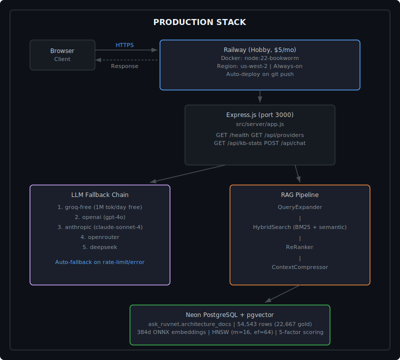
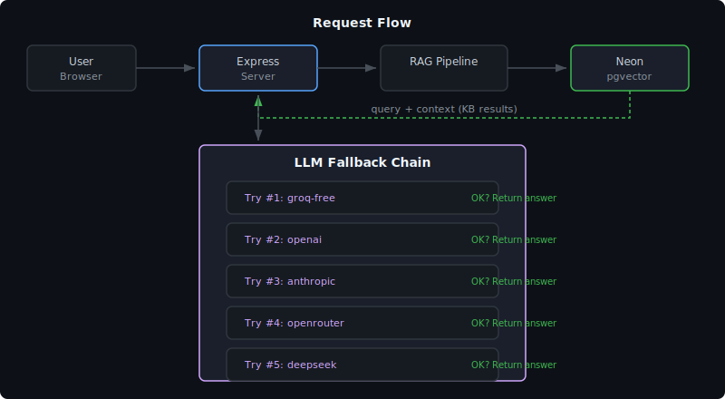
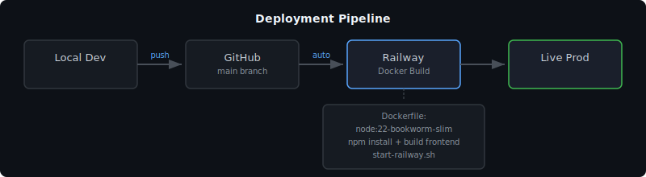
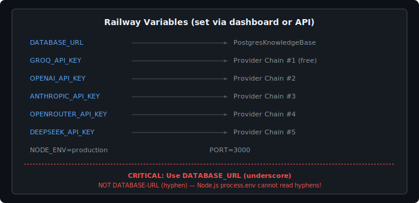
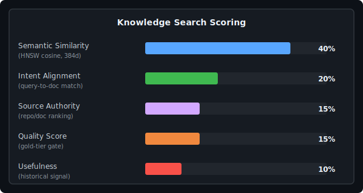

Updated: 2026-02-24 01:55:00 EST | Version 1.0.0
Created: 2026-02-24

# Ask-RuvNet Production Architecture

## System Overview



<details>
<summary>ASCII Version (for AI/accessibility)</summary>

```
┌─────────────────────────────────────────────────────────────────┐
│                        PRODUCTION STACK                         │
│                                                                 │
│  ┌──────────┐    HTTPS     ┌──────────────────────────────┐   │
│  │  Browser  │────────────>│  Railway (Hobby, $5/mo)      │   │
│  │  Client   │<────────────│  Docker: node:22-bookworm     │   │
│  └──────────┘   Response   │  Region: us-west-2           │   │
│                             │  Always-on (no cold start)   │   │
│                             │  Auto-deploy on git push     │   │
│                             └──────────┬───────────────────┘   │
│                                        │                        │
│                             ┌──────────▼───────────────────┐   │
│                             │  Express.js (port 3000)      │   │
│                             │  src/server/app.js           │   │
│                             │                              │   │
│                             │  Endpoints:                  │   │
│                             │    GET  /health              │   │
│                             │    GET  /api/providers       │   │
│                             │    GET  /api/kb-stats        │   │
│                             │    POST /api/chat            │   │
│                             └───┬──────────────┬───────────┘   │
│                                 │              │                │
│              ┌──────────────────▼──┐   ┌──────▼────────────┐   │
│              │  LLM Fallback Chain │   │  RAG Pipeline      │   │
│              │                     │   │                    │   │
│              │  1. groq-free       │   │  QueryExpander     │   │
│              │     1M tok/day free │   │       │            │   │
│              │  2. openai (gpt-4o) │   │  HybridSearch      │   │
│              │  3. anthropic       │   │  (BM25 + semantic) │   │
│              │  4. openrouter      │   │       │            │   │
│              │  5. deepseek        │   │  ReRanker          │   │
│              │                     │   │       │            │   │
│              │  Auto-fallback on   │   │  ContextCompressor │   │
│              │  rate-limit/error   │   │       │            │   │
│              └─────────────────────┘   │  MultiHopRetriever │   │
│                                        └──────┬─────────────┘   │
│                                               │                 │
│                             ┌──────────────────▼──────────────┐ │
│                             │  Neon PostgreSQL + pgvector     │ │
│                             │                                 │ │
│                             │  Host: ep-holy-pine-aksbss0s    │ │
│                             │  Schema: ask_ruvnet             │ │
│                             │  Table: architecture_docs       │ │
│                             │  Rows: 54,543 (22,667 gold)    │ │
│                             │  Embeddings: 384d ONNX          │ │
│                             │  Index: HNSW (m=16, ef=64)     │ │
│                             │  Scoring: 5-factor relevance   │ │
│                             └─────────────────────────────────┘ │
└─────────────────────────────────────────────────────────────────┘
```

</details>

## Request Flow



<details>
<summary>ASCII Version (for AI/accessibility)</summary>

```
┌──────────┐     ┌───────────┐     ┌──────────────┐     ┌─────────┐
│  User    │────>│  Express  │────>│  RAG Pipeline│────>│  Neon   │
│  Browser │     │  Server   │     │              │     │  pgvec  │
└──────────┘     └─────┬─────┘     └──────┬───────┘     └────┬────┘
                       │                  │                   │
                       │    query + context                   │
                       │<─────────────────────────────────────┘
                       │                                 KB results
                       │
                 ┌─────▼──────┐
                 │  LLM Chain │
                 │            │
                 │  Try #1:   │
                 │  groq-free │──> OK? Return answer
                 │            │
                 │  Try #2:   │
                 │  openai    │──> OK? Return answer
                 │            │
                 │  Try #3:   │
                 │  anthropic │──> OK? Return answer
                 │            │
                 │  Try #4:   │
                 │  openrouter│──> OK? Return answer
                 │            │
                 │  Try #5:   │
                 │  deepseek  │──> OK? Return answer
                 └────────────┘
```

</details>

## Deployment Pipeline



<details>
<summary>ASCII Version (for AI/accessibility)</summary>

```
┌──────────┐     ┌──────────┐     ┌──────────┐     ┌──────────┐
│  Local   │     │  GitHub   │     │  Railway  │     │  Live    │
│  Dev     │────>│  main     │────>│  Docker   │────>│  Prod    │
│          │push │  branch   │auto │  Build    │     │          │
└──────────┘     └──────────┘     └──────────┘     └──────────┘
                                       │
                                  Dockerfile:
                                  - node:22-slim
                                  - npm install
                                  - build frontend
                                  - start-railway.sh
```

</details>

## Environment Variable Flow



<details>
<summary>ASCII Version (for AI/accessibility)</summary>

```
┌─────────────────────────────────────────────────┐
│  Railway Variables (set via dashboard or API)    │
│                                                  │
│  DATABASE_URL ─────────> PostgresKnowledgeBase  │
│  GROQ_API_KEY ─────────> Provider Chain #1      │
│  OPENAI_API_KEY ───────> Provider Chain #2      │
│  ANTHROPIC_API_KEY ────> Provider Chain #3      │
│  OPENROUTER_API_KEY ───> Provider Chain #4      │
│  DEEPSEEK_API_KEY ─────> Provider Chain #5      │
│  NODE_ENV=production                             │
│  PORT=3000                                       │
│                                                  │
│  CRITICAL: Use DATABASE_URL (underscore)         │
│  NOT DATABASE-URL (hyphen)                       │
│  Node.js process.env cannot read hyphens!        │
└─────────────────────────────────────────────────┘
```

</details>

## 5-Factor Relevance Scoring



<details>
<summary>ASCII Version (for AI/accessibility)</summary>

```
┌─────────────────────────────────────────────────┐
│            Knowledge Search Scoring              │
│                                                  │
│  Semantic Similarity   40%  ████████████         │
│  (HNSW cosine, 384d)                            │
│                                                  │
│  Intent Alignment      20%  ██████               │
│  (query-to-doc match)                            │
│                                                  │
│  Source Authority       15%  █████                │
│  (repo/doc ranking)                              │
│                                                  │
│  Quality Score          15%  █████                │
│  (gold-tier gate)                                │
│                                                  │
│  Usefulness             10%  ████                 │
│  (historical signal)                             │
│                                                  │
│  Final score = weighted sum → top-K to LLM      │
└─────────────────────────────────────────────────┘
```

</details>
