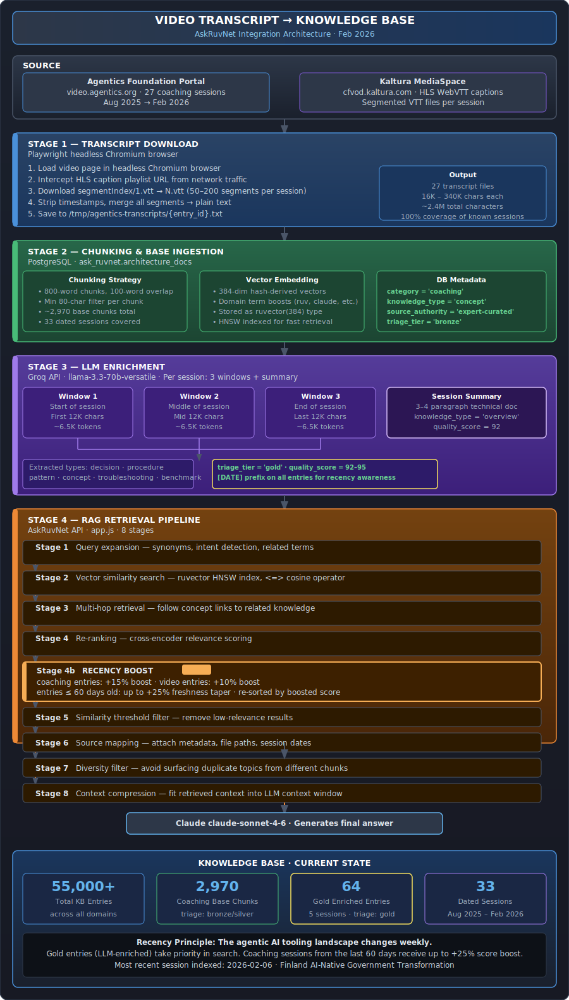

# Video Transcript → Knowledge Base Integration Architecture

## Overview

The AskRuvNet Knowledge Base ingests live coaching session videos from the Agentics Foundation portal, transforms raw transcripts into structured, searchable knowledge, and applies intelligent recency weighting so the newest AI guidance always surfaces first.

---

## Architecture Flow



<details>
<summary>ASCII Version (for AI/accessibility)</summary>

```
┌─────────────────────────────────────────────────────────────────────────────────┐
│                     VIDEO TRANSCRIPT KB INTEGRATION PIPELINE                    │
└─────────────────────────────────────────────────────────────────────────────────┘

  ┌──────────────────────────────────────────────────────────────────────────────┐
  │  SOURCE                                                                      │
  │                                                                              │
  │  Agentics Foundation Portal          Kaltura MediaSpace                      │
  │  video.agentics.org                  (cfvod.kaltura.com)                     │
  │  27 coaching sessions                HLS WebVTT captions                    │
  │  Aug 2025 → Feb 2026                 Segmented VTT files                    │
  └────────────────────────┬─────────────────────────────┬──────────────────────┘
                           │                             │
                           ▼                             ▼
  ┌──────────────────────────────────────────────────────────────────────────────┐
  │  STAGE 1 — TRANSCRIPT DOWNLOAD  (Playwright headless browser)                │
  │                                                                              │
  │  1. Load video page in headless Chromium                                     │
  │  2. Intercept HLS caption playlist URL from network traffic                  │
  │  3. Download segmentIndex/1.vtt → N.vtt (50-200 segments per session)        │
  │  4. Strip timestamps, merge segments → plain text                            │
  │  5. Save to /tmp/agentics-transcripts/{entry_id}.txt                         │
  │                                                                              │
  │  Output: 27 transcript files · 16K–340K chars each                           │
  └────────────────────────────────────────┬───────────────────────────────────-┘
                                           │
                                           ▼
  ┌──────────────────────────────────────────────────────────────────────────────┐
  │  STAGE 2 — CHUNKING & BASE INGESTION                                         │
  │                                                                              │
  │  Chunking Strategy                    Embedding                              │
  │  ─────────────────                    ─────────                              │
  │  • 800-word chunks                    • 384-dim hash-derived vectors         │
  │  • 100-word overlap                   • Domain term boosts applied           │
  │  • Min 80-char filter                 • Stored as ruvector(384)              │
  │                                                                              │
  │  DB Table: ask_ruvnet.architecture_docs                                      │
  │  ─────────────────────────────────────                                       │
  │  category = 'coaching'                                                       │
  │  knowledge_type = 'concept'                                                  │
  │  source_authority = 'expert-curated'                                         │
  │  quality_score = 85–88                                                       │
  │  triage_tier = 'bronze'                                                      │
  │                                                                              │
  │  Result: ~2,970 base chunks across 33 dated sessions                         │
  └────────────────────────────────────────┬────────────────────────────────────┘
                                           │
                                           ▼
  ┌──────────────────────────────────────────────────────────────────────────────┐
  │  STAGE 3 — LLM ENRICHMENT  (Groq · llama-3.3-70b-versatile)                 │
  │                                                                              │
  │  Per session (multi-window coverage):                                        │
  │                                                                              │
  │  ┌─────────────┐   ┌──────────────┐   ┌───────────┐   ┌──────────────────┐  │
  │  │  Window 1   │   │  Window 2    │   │ Window 3  │   │ Session Summary  │  │
  │  │  (start     │   │  (middle     │   │ (end      │   │ 3–4 paragraph    │  │
  │  │   12K chars)│   │   12K chars) │   │ 12K chars)│   │ technical doc    │  │
  │  └──────┬──────┘   └──────┬───────┘   └─────┬─────┘   └────────┬─────────┘  │
  │         └─────────────────┴────────────────-┘                  │             │
  │                           │                                     │            │
  │                           ▼                                     ▼            │
  │              Extracted knowledge types:           Summary entry:             │
  │              • decision                           knowledge_type='overview'  │
  │              • procedure                          quality_score = 92         │
  │              • pattern                                                        │
  │              • concept                                                        │
  │              • troubleshooting                                                │
  │              • benchmark → 'reference'                                       │
  │                                                                              │
  │  Output stored with:                                                         │
  │  triage_tier = 'gold'  ·  quality_score = 92–95  ·  [DATE] prefix           │
  │                                                                              │
  │  Rate management: TokenBudget class tracks 60s rolling TPM window,           │
  │  pre-emptively paces calls to stay within 11K/12K TPM limit.                 │
  └────────────────────────────────────────┬────────────────────────────────────┘
                                           │
                                           ▼
  ┌──────────────────────────────────────────────────────────────────────────────┐
  │  STAGE 4 — RAG RETRIEVAL  (AskRuvNet API · app.js)                           │
  │                                                                              │
  │  Stage 1  Query expansion (synonyms + intent)                                │
  │     │                                                                        │
  │  Stage 2  Vector similarity search  (ruvector HNSW  <=> operator)            │
  │     │                                                                        │
  │  Stage 3  Multi-hop retrieval  (follow concept links)                        │
  │     │                                                                        │
  │  Stage 4  Re-ranking  (cross-encoder score)                                  │
  │     │                                                                        │
  │  Stage 4b RECENCY BOOST  ◄──── NEW ────────────────────────────────────────  │
  │     │      coaching entries:  +15% base boost                                │
  │     │      video entries:     +10% base boost                                │
  │     │      entries ≤60 days:  up to +25% freshness taper                    │
  │     │      re-sort by boosted score                                          │
  │     │                                                                        │
  │  Stage 5  Similarity threshold filter                                        │
  │     │                                                                        │
  │  Stage 6  Source mapping                                                     │
  │     │                                                                        │
  │  Stage 7  Diversity filter  (avoid duplicate topics)                         │
  │     │                                                                        │
  │  Stage 8  Context compression  (fit LLM context window)                      │
  │     │                                                                        │
  │     ▼                                                                        │
  │  Claude claude-sonnet-4-6 generates final response                           │
  └──────────────────────────────────────────────────────────────────────────────┘

  ┌──────────────────────────────────────────────────────────────────────────────┐
  │  KNOWLEDGE BASE CURRENT STATE                                                │
  │                                                                              │
  │  Total entries:        55,000+                                               │
  │  Coaching (base):       2,970  chunks  ·  triage: bronze/silver              │
  │  Coaching (enriched):      64  gold    ·  triage: gold  (5 sessions done)    │
  │  Sessions covered:         33  dated sessions  ·  Aug 2025 – Feb 2026        │
  │  Most recent session:  2026-02-06  (Finland AI Gov Transformation)           │
  └──────────────────────────────────────────────────────────────────────────────┘
```

</details>

---

## Key Design Decisions

### Why Playwright instead of the Kaltura API?
Kaltura's API requires an authenticated session token — anonymous calls return 403. Playwright loads the actual video page in a headless browser, which causes the Kaltura player to request its own caption playlist, and we intercept that URL from the network traffic. No auth bypass — we're using the same access path as any viewer.

### Why multi-window LLM enrichment?
A 2-hour coaching session produces ~340K chars of transcript. An LLM context window handles ~12K chars at a time. Rather than truncating (losing 96% of content), three windows cover start, middle, and end of each session, ensuring key decisions from any part of the session are captured.

### Why recency boost in the RAG pipeline?
The agentic AI tooling landscape changes weekly. A coaching session from February 2026 about claude-flow v3 architecture supersedes a September 2025 session about v2 patterns. Without explicit recency weighting, vector similarity alone will surface older content equally — and older guidance may be actively wrong for current versions.

### Gold vs Bronze tiers
Raw transcript chunks (bronze) are useful for broad keyword coverage. LLM-enriched entries (gold) are self-contained, structured, and precise — they're what the RAG system should primarily surface. The two tiers coexist so neither completeness nor precision is sacrificed.

---

## Infrastructure

| Component | Technology |
|-----------|------------|
| Video source | Kaltura MediaSpace (Agentics Foundation) |
| Browser automation | Playwright (headless Chromium) |
| Database | PostgreSQL + ruvector extension (port 5435) |
| Vector search | HNSW index via `<=>` operator |
| LLM enrichment | Groq API · llama-3.3-70b-versatile |
| RAG pipeline | Node.js · app.js (8 stages) |
| Answer generation | Anthropic Claude claude-sonnet-4-6 |
